# 🔍 DATABASE FORENSIC MAP — APEX PLATFORM

**Audit Date:** 2026-04-04  
**Auditor:** Lead DBRE / Chief Data Architect  
**Scope:** Full read-only forensic audit of all PostgreSQL schemas, tables, FKs, constraints, RLS policies, and operational status  
**Version:** v4.0.1 — Multi-Tenant Schema-Per-Tenant Isolation  

---

## 📐 ARCHITECTURAL OVERVIEW

The platform uses a **PostgreSQL multi-tenant architecture with schema-per-tenant isolation**. Each tenant gets its own PostgreSQL schema cloned from the `storefront` template. A centralized `governance` schema manages cross-cutting concerns (tenants, users, billing, audit, feature flags).

### PostgreSQL Schemas

| Schema | Purpose | Isolation Level |
|--------|---------|----------------|
| `public` | Shared extensions, enum types, migration tracking | Global |
| `governance` | Platform control plane — tenants, users, billing, audit, blueprints, fraud | Global (RLS-enforced) |
| `storefront` | Template schema — cloned for every new tenant | Template |
| `tenant_{subdomain}_v2` | Live tenant instances (dynamic, one per merchant) | Full schema isolation |
| `vault` | Encryption keys, archival tombstones | Global (RLS-enforced) |
| `shared` | Reserved — cross-tenant shared data (currently empty) | Reserved |
| `legacy` | Reserved — legacy migration staging (currently empty) | Reserved |

### Key Extensions
- `pgvector` — 1536-dimension embeddings for semantic search (products, reviews)
- `btree_gist` — GiST overlap indexes for range-type constraints (pricing tiers, flash sales)
- `pg_partman` — Declarative partition management for time-series tables

---

## 🔢 ENUM LEDGER (33 enum types in `public` schema)

| Enum | Values | Used By |
|------|--------|---------|
| `actor_type` | `super_admin`, `tenant_admin`, `system` | `governance.audit_logs` |
| `affiliate_status` | `active`, `pending`, `suspended` | `storefront.affiliate_partners` |
| `affiliate_tx_status` | `pending`, `approved`, `paid`, `rejected` | `storefront.affiliate_transactions` |
| `audit_result_enum` | `SUCCESS`, `FAILURE` | `governance.audit_logs` |
| `b2b_company_status` | `active`, `pending`, `suspended` | `storefront.b2b_companies` |
| `b2b_user_role` | `admin`, `buyer`, `viewer` | `storefront.b2b_users` |
| `blueprint_status` | `active`, `paused` | `governance.onboarding_blueprints` |
| `consent_channel` | `email`, `sms`, `push`, `whatsapp` | `storefront.customer_consents` |
| `discount_applies_to` | `all`, `specific_products`, `specific_categories`, `specific_customers` | `storefront.price_rules` |
| `discount_type` | `percentage`, `fixed`, `buy_x_get_y`, `free_shipping` | `storefront.price_rules` |
| `dunning_status` | `pending`, `retried`, `failed`, `recovered` | `governance.dunning_events` |
| `fulfillment_status` | `pending`, `shipped`, `in_transit`, `delivered`, `failed` | `storefront.fulfillments` |
| `inventory_movement_type` | `in`, `out`, `adjustment`, `return`, `transfer` | `storefront.inventory_movements` |
| `invoice_status` | `draft`, `issued`, `paid`, `overdue` | `governance.tenant_invoices` |
| `lead_status` | `new`, `contacted`, `qualified`, `converted` | `governance.leads` |
| `location_type` | `warehouse`, `retail`, `dropship` | `storefront.locations` |
| `niche_type` | `retail`, `wellness`, `education`, `services`, `hospitality`, `real_estate`, `creative`, `food`, `digital` | `governance.tenants`, `storefront.products` |
| `order_source` | `web`, `mobile`, `b2b`, `pos` | `storefront.orders` |
| `order_status` | `draft`, `awaiting_approval`, `pending`, `processing`, `shipped`, `delivered`, `cancelled`, `returned` | `storefront.orders` |
| `outbox_status` | `pending`, `processing`, `completed`, `failed` | `storefront.outbox_events` |
| `payment_method` | `card`, `cod`, `wallet`, `bnpl`, `bank_transfer` | `storefront.orders` |
| `payment_status` | `pending`, `paid`, `partially_refunded`, `refunded`, `failed` | `storefront.orders` |
| `purchase_order_status` | `draft`, `ordered`, `partial`, `received`, `cancelled` | `storefront.purchase_orders` |
| `refund_status` | `pending`, `processed`, `failed` | `storefront.refunds` |
| `reservation_status` | `active`, `converted`, `expired` | `storefront.inventory_reservations` |
| `rma_condition` | `new`, `opened`, `damaged` | `storefront.rma_requests` |
| `rma_reason_code` | `defective`, `wrong_item`, `changed_mind`, `not_as_described`, `damaged_in_transit` | `storefront.rma_requests` |
| `rma_resolution` | `refund`, `exchange`, `store_credit` | `storefront.rma_requests` |
| `rma_status` | `requested`, `approved`, `shipped`, `received`, `completed`, `rejected` | `storefront.rma_requests` |
| `severity_enum` | `INFO`, `WARNING`, `CRITICAL`, `SECURITY_ALERT` | `governance.audit_logs` |
| `tenant_niche` | `retail`, `wellness`, `education`, `services`, `hospitality`, `real_estate`, `creative` | `governance.onboarding_blueprints` |
| `tenant_plan` | `free`, `basic`, `pro`, `enterprise` | `governance.tenants`, `governance.subscription_plans` |
| `tenant_status` | `active`, `suspended`, `pending`, `archived`, `purging`, `deleted` | `governance.tenants` |
| `transfer_status` | `draft`, `in_transit`, `received`, `cancelled` | `storefront.inventory_transfers` |

> ⚠️ **DRIFT NOTE:** `tenant_niche` enum has 7 values, but `niche_type` has 9 (`food`, `digital` are extra). Blueprint uses `tenant_niche`, products use `niche_type`. This is a known enum mismatch.

---

## 🗄️ GOVERNANCE SCHEMA (16 tables)

**Purpose:** Platform-level control plane. Manages tenant lifecycle, authentication, billing, audit, feature flags, and fraud detection.

### 1. `governance.tenants` 🟢 ACTIVE/TESTED
**Purpose:** Central tenant registry — the source of truth for every merchant on the platform.

| Column | Type | Constraints |
|--------|------|-------------|
| `id` | uuid | PK, default random |
| `created_at` | timestamptz | NOT NULL, default now() |
| `updated_at` | timestamptz | NOT NULL, default now() |
| `deleted_at` | timestamptz | NULL (soft delete) |
| `trial_ends_at` | timestamptz | NULL |
| `suspended_at` | timestamptz | NULL |
| `plan` | tenant_plan | DEFAULT 'free', NOT NULL |
| `status` | tenant_status | DEFAULT 'active', NOT NULL |
| `subdomain` | text | NOT NULL, UNIQUE (WHERE deleted_at IS NULL) |
| `custom_domain` | text | NULL, UNIQUE (WHERE deleted_at IS NULL) |
| `name` | text | NOT NULL |
| `owner_email` | jsonb | S7 encrypted |
| `owner_email_hash` | text | NOT NULL, indexed |
| `suspended_reason` | text | NULL |
| `niche_type` | text | DEFAULT 'retail' |
| `niche_type_hash` | text | NULL |
| `ui_config` | jsonb | DEFAULT '{}', max 200KB |
| `data_region` | char(2) | DEFAULT 'SA' |
| `timezone` | varchar(50) | DEFAULT 'UTC' |

**Indexes:** `idx_tenants_email_hash` (btree), `tenants_subdomain_unique` (partial), `tenants_custom_domain_unique` (partial)  
**RLS:** `tenant_isolation_policy` on `id` | **FORCE RLS:** enabled  
**Checks:** `chk_owner_email_s7` (S7 encryption), `chk_ui_config_size` (≤200KB)  
**FKs:** None (root entity)  
**Used By:** `TenantsController` (CRUD), `AuthController` (login lookup), `ProvisioningService` (lifecycle)  
**Frontend:** Super Admin tenant management, Merchant Admin login

---

### 2. `governance.users` 🟢 ACTIVE/TESTED
**Purpose:** Merchant user accounts in the governance plane (not tenant-scoped — global user registry).

| Column | Type | Constraints |
|--------|------|-------------|
| `id` | uuid | PK |
| `email` | jsonb | S7 encrypted, NOT NULL |
| `email_hash` | text | NOT NULL, UNIQUE, indexed |
| `password_hash` | text | NOT NULL (bcrypt) |
| `roles` | text[] | DEFAULT ['merchant'] |
| `created_at` | timestamptz | |
| `updated_at` | timestamptz | |

**Checks:** `chk_user_email_s7` (S7), `chk_user_pwd_hash` (bcrypt format `^\$2[ayb]\$.+$`)  
**FKs:** None  
**Used By:** `AuthController` (login), `ProvisioningService` (user registration)

---

### 3. `governance.onboarding_blueprints` 🟢 ACTIVE/TESTED
**Purpose:** Blueprint templates for tenant provisioning — defines initial state for new tenants.

| Column | Type | Constraints |
|--------|------|-------------|
| `id` | uuid | PK |
| `name` | text | NOT NULL |
| `description` | text | |
| `plan` | tenant_plan | DEFAULT 'free' |
| `niche_type` | tenant_niche | DEFAULT 'retail' |
| `status` | blueprint_status | DEFAULT 'active' |
| `is_default` | boolean | DEFAULT false |
| `blueprint` | jsonb | NOT NULL (module configs) |
| `ui_config` | jsonb | NOT NULL |
| `created_at` | timestamptz | |
| `updated_at` | timestamptz | |

**Indexes:** `blueprint_niche_plan_idx` (niche_type, plan)  
**FKs:** None  
**Used By:** `BlueprintsController` (full CRUD), `ProvisioningService` (resolve during provisioning)  
**Frontend:** Super Admin blueprint builder/editor

---

### 4. `governance.feature_gates` 🟢 ACTIVE/TESTED
**Purpose:** Per-tenant feature flag system — enables/disables features by plan or explicit override.

| Column | Type | Constraints |
|--------|------|-------------|
| `id` | uuid | PK |
| `tenant_id` | uuid | NOT NULL |
| `feature_key` | varchar(100) | NOT NULL |
| `is_enabled` | boolean | DEFAULT false |
| `plan_code` | varchar(50) | |
| `rollout_percentage` | int | DEFAULT 100 |
| `metadata` | jsonb | |
| `created_at` | timestamptz | |

**Unique:** `(tenant_id, feature_key)`  
**Checks:** `chk_fg_meta_size` (≤50KB), `chk_rollout_range` (0–100)  
**RLS:** on `tenant_id`  
**Used By:** `TenantsController` (toggle features), `ProvisioningService` (sync from blueprint)  
**Frontend:** Super Admin TenantGovernanceModal

---

### 5. `governance.tenant_quotas` 🟢 ACTIVE/TESTED
**Purpose:** Resource limits per tenant (products, orders, staff, storage, API rate).

| Column | Type | Constraints |
|--------|------|-------------|
| `id` | uuid | PK |
| `tenant_id` | uuid | NOT NULL |
| `max_products` | int | |
| `max_orders` | int | |
| `max_pages` | int | |
| `max_staff` | int | |
| `max_categories` | int | |
| `max_coupons` | int | |
| `storage_limit_gb` | int | DEFAULT 1 |
| `api_rate_limit` | int | |
| `updated_at` | timestamptz | |

**RLS:** on `tenant_id`  
**Used By:** `QuotaInterceptor` (middleware), `ProvisioningService` (create from blueprint)  
**Frontend:** None directly (enforced server-side)

---

### 6. `governance.subscription_plans` 🟢 ACTIVE/TESTED
**Purpose:** Pricing plan definitions (free, basic, pro, enterprise) with limits and pricing.

| Column | Type | Constraints |
|--------|------|-------------|
| `id` | uuid | PK |
| `code` | tenant_plan | NOT NULL, UNIQUE |
| `name` | varchar(100) | |
| `description` | text | |
| `price_monthly` | bigint | NOT NULL (legacy) |
| `price_yearly` | bigint | NOT NULL (legacy) |
| `price_monthly_v2` | numeric(12,4) | |
| `price_yearly_v2` | numeric(12,4) | |
| `currency` | varchar(3) | DEFAULT 'USD' |
| `default_max_products` | int | DEFAULT 50 |
| `default_max_orders` | int | DEFAULT 100 |
| `default_max_pages` | int | DEFAULT 5 |
| `default_max_staff` | int | DEFAULT 3 |
| `default_max_storage_gb` | int | DEFAULT 1 |
| `sort_order` | int | DEFAULT 0 |
| `is_active` | boolean | DEFAULT true |
| `created_at` | timestamptz | |
| `updated_at` | timestamptz | |

**Checks:** `chk_plan_price` (v2 prices ≥ 0)  
**Used By:** `ProvisioningService` (plan validation)

---

### 7. `governance.audit_logs` 🔴 RISK/DEBT
**Purpose:** Immutable audit trail of all platform actions (WORM-protected, partitioned by date).

| Column | Type | Constraints |
|--------|------|-------------|
| `id` | uuid | NOT NULL (composite PK with created_at) |
| `created_at` | timestamptz | NOT NULL (partition key) |
| `severity` | severity_enum | DEFAULT 'INFO' |
| `result` | audit_result_enum | DEFAULT 'SUCCESS' |
| `tenant_id` | uuid | NOT NULL |
| `actor_type` | actor_type | DEFAULT 'tenant_admin' |
| `user_id` | text | |
| `user_email` | jsonb | S7 encrypted |
| `entity_type` | varchar(100) | |
| `entity_id` | varchar(100) | |
| `action` | text | NOT NULL |
| `public_key` | text | NOT NULL |
| `encrypted_key` | bytea | NOT NULL |
| `user_agent` | text | |
| `old_values` | jsonb | max 100KB |
| `new_values` | jsonb | max 100KB |
| `metadata` | jsonb | |
| `impersonator_id` | uuid | |
| `checksum` | text | |
| `version` | int | DEFAULT 1 |

**⚠️ CRITICAL: NOT in Drizzle schema.ts** — exists only in SQL migration and HCL. Schema drift risk.  
**Partition:** RANGE by `created_at`  
**WORM Trigger:** Blocks all UPDATE/DELETE  
**Checks:** `chk_audit_email_s7`, `chk_audit_json_size`, `chk_audit_sanitization` (no passwords/tokens/CVV)  
**RLS:** on `tenant_id`  
**Indexes:** BRIN on created_at, btree on action/entity/tenant  

---

### 8. `governance.order_fraud_scores` 🟢 ACTIVE/TESTED
**Purpose:** ML-based fraud scoring per order.

| Column | Type | Constraints |
|--------|------|-------------|
| `id` | uuid | PK |
| `order_id` | uuid | NOT NULL |
| `tenant_id` | uuid | NOT NULL |
| `risk_score` | int | 0–1000 |
| `is_flagged` | boolean | DEFAULT false |
| `is_reviewed` | boolean | DEFAULT false |
| `reviewed_by` | text | |
| `decision` | text | |
| `provider` | text | DEFAULT 'internal' |
| `ml_model_version` | varchar(50) | DEFAULT 'v1.0.0' |
| `signals` | jsonb | NOT NULL |
| `created_at` | timestamptz | |

**Unique:** `(id, tenant_id)` composite  
**Indexes:** Partial on `is_flagged=true AND is_reviewed=false`  
**RLS:** on `tenant_id`  
**Checks:** `chk_risk_score_range` (0–1000)  

---

### 9. `governance.leads` ⚪ PENDING/DORMANT
**Purpose:** Lead capture and scoring system for CRM functionality.

| Column | Type | Constraints |
|--------|------|-------------|
| `id` | uuid | PK |
| `lead_score` | int | |
| `status` | lead_status | DEFAULT 'new' |
| `email` | jsonb | S7 encrypted, NOT NULL |
| `email_hash` | text | NOT NULL, indexed |
| `name` | jsonb | S7 encrypted |
| `notes` | jsonb | S7 encrypted |
| `source` | varchar(50) | |
| `landing_page_url` | text | |
| `utm_source/medium/campaign` | varchar | |
| `tags` | jsonb | NOT NULL |
| `converted_tenant_id` | uuid | |
| `created_at` | timestamptz | |

**RLS:** on `converted_tenant_id`  
**Checks:** `chk_leads_email_s7`, `chk_leads_name_s7`, `chk_leads_notes_s7`  
**FKs:** None  
**Used By:** No controller or API endpoint found  

---

### 10. `governance.dunning_events` ⚪ PENDING/DORMANT
**Purpose:** Payment retry/failure tracking for subscription billing recovery.

| Column | Type | Constraints |
|--------|------|-------------|
| `id` | uuid | PK |
| `tenant_id` | uuid | NOT NULL |
| `attempt_number` | int | DEFAULT 1, max 5 |
| `status` | dunning_status | DEFAULT 'pending' |
| `amount` | numeric(12,4) | NOT NULL, > 0 |
| `next_retry_at` | timestamptz | |
| `payment_method` | text | |
| `error_message` | text | |
| `created_at` | timestamptz | |

**Checks:** `chk_dunning_amount` (>0), `chk_dunning_attempts` (≤5)  
**RLS:** on `tenant_id`  
**Used By:** No controller found  

---

### 11. `governance.tenant_invoices` ⚪ PENDING/DORMANT
**Purpose:** Billing invoices for tenant subscription charges.

| Column | Type | Constraints |
|--------|------|-------------|
| `id` | uuid | PK |
| `tenant_id` | uuid | NOT NULL |
| `period_start` | date | |
| `period_end` | date | |
| `subscription_amount` | numeric(12,4) | DEFAULT 0 |
| `platform_commission` | numeric(12,4) | DEFAULT 0 |
| `app_charges` | numeric(12,4) | DEFAULT 0 |
| `total` | numeric(12,4) | |
| `status` | invoice_status | DEFAULT 'draft' |
| `currency` | char(3) | DEFAULT 'USD' |
| `pdf_url` | text | |
| `paid_at` | timestamptz | |
| `created_at` | timestamptz | |

**Checks:** `chk_invoice_math` (total = sum of components), `chk_invoice_period` (end ≥ start)  
**RLS:** on `tenant_id`  
**Used By:** No controller found  

---

### 12. `governance.plan_change_history` ⚪ PENDING/DORMANT
**Purpose:** Audit trail of tenant plan changes.

| Column | Type | Constraints |
|--------|------|-------------|
| `id` | uuid | PK |
| `tenant_id` | uuid | NOT NULL |
| `from_plan` | varchar(50) | |
| `to_plan` | varchar(50) | |
| `reason` | text | |
| `changed_by` | text | NOT NULL |
| `created_at` | timestamptz | |

**RLS:** on `tenant_id`  
**Used By:** No controller found  

---

### 13. `governance.app_usage_records` ⚪ PENDING/DORMANT
**Purpose:** Metered billing for app-level usage (per-app charges).

| Column | Type | Constraints |
|--------|------|-------------|
| `id` | uuid | PK |
| `tenant_id` | uuid | NOT NULL |
| `app_id` | uuid | NOT NULL |
| `quantity` | int | NOT NULL |
| `unit_price` | numeric(12,4) | NOT NULL |
| `currency` | char(3) | DEFAULT 'USD' |
| `metric` | varchar(50) | NOT NULL |
| `created_at` | timestamptz | |

**RLS:** on `tenant_id`  
**Used By:** No controller found  

---

### 14. `governance.marketing_pages` ⚪ PENDING/DORMANT
**Purpose:** Landing pages and marketing content managed at the platform level.

| Column | Type | Constraints |
|--------|------|-------------|
| `id` | uuid | PK |
| `slug` | text | NOT NULL, UNIQUE |
| `page_type` | text | DEFAULT 'landing' |
| `title` | jsonb | NOT NULL |
| `content` | jsonb | NOT NULL |
| `meta_title` | text | |
| `meta_description` | text | |
| `is_published` | boolean | DEFAULT false |
| `published_at` | timestamptz | |
| `created_by` | text | |
| `created_at` | timestamptz | |
| `updated_at` | timestamptz | |

**Indexes:** `idx_mkt_published`, `idx_mkt_slug`, `idx_mkt_type`  
**RLS:** None  
**Used By:** No controller found  

---

### 15. `governance.schema_drift_log` ⚪ PENDING/DORMANT
**Purpose:** Tracks DDL changes (CREATE/ALTER/DROP) across all schemas for audit.

| Column | Type | Constraints |
|--------|------|-------------|
| `id` | uuid | PK |
| `command_tag` | text | |
| `object_type` | text | |
| `object_identity` | text | |
| `actor_id` | text | |
| `ip_address` | inet | |
| `user_agent` | text | |
| `executed_at` | timestamptz | |

**Indexes:** BRIN on `executed_at`  
**RLS:** None  
**Used By:** No controller — likely populated by PostgreSQL event trigger  

---

### 16. `governance.system_config` ⚪ PENDING/DORMANT
**Purpose:** Global platform configuration key-value store.

| Column | Type | Constraints |
|--------|------|-------------|
| `key` | varchar(100) | PK |
| `value` | jsonb | NOT NULL |
| `updated_at` | timestamptz | |

**RLS:** None  
**Used By:** No controller found  

---

## 🏛️ VAULT SCHEMA (2 tables)

**Purpose:** Cryptographic key management and soft-delete archival tombstones.

### 1. `vault.encryption_keys` 🟢 ACTIVE/TESTED
**Purpose:** Per-tenant AES-256-GCM key material for S7 encryption (email, phone, PII).

| Column | Type | Constraints |
|--------|------|-------------|
| `id` | uuid | PK |
| `tenant_id` | uuid | NOT NULL |
| `key_version` | int | DEFAULT 1 |
| `is_active` | boolean | DEFAULT true |
| `algorithm` | varchar(20) | DEFAULT 'AES-256-GCM' |
| `key_fingerprint` | varchar(64) | |
| `key_material` | jsonb | NOT NULL (S7 encrypted structure) |
| `created_at` | timestamptz | |
| `rotated_at` | timestamptz | |
| `expires_at` | timestamptz | |

**RLS:** on `tenant_id`  
**Checks:** `chk_key_material_s7`  
**Used By:** `@apex/security` package (`hashSensitiveData`, encryption utilities)

---

### 2. `vault.archival_vault` ⚪ PENDING/DORMANT
**Purpose:** Tombstone storage for soft-deleted records (forensic preservation).

| Column | Type | Constraints |
|--------|------|-------------|
| `id` | uuid | PK |
| `table_name` | text | NOT NULL |
| `original_id` | text | NOT NULL |
| `tenant_id` | uuid | NOT NULL |
| `deleted_at` | timestamptz | |
| `deleted_by` | text | NOT NULL |
| `payload` | jsonb | NOT NULL (max 100KB) |
| `tombstone_hash` | text | NOT NULL |

**RLS:** on `tenant_id`  
**Checks:** `chk_payload_size` (≤100KB)  
**Used By:** No controller found  

---

## 🏪 STOREFRONT SCHEMA (70 tables — per-tenant template)

**Purpose:** E-commerce storefront — cloned into each `tenant_{subdomain}_v2` schema.

---

### 🛍️ CATALOG DOMAIN

### 1. `storefront.products` 🟢 ACTIVE/TESTED
**Purpose:** Core product catalog — the most feature-rich table in the entire system.

| Column | Type | Constraints |
|--------|------|-------------|
| `id` | uuid | PK |
| `name` | jsonb | S7 encrypted, NOT NULL |
| `slug` | varchar(255) | NOT NULL, UNIQUE (WHERE deleted_at IS NULL) |
| `sku` | varchar(100) | NOT NULL, UNIQUE (WHERE deleted_at IS NULL) |
| `base_price` | numeric(12,4) | NOT NULL, ≥ 0 |
| `sale_price` | numeric(12,4) | ≤ base_price |
| `cost_price` | numeric(12,4) | |
| `compare_at_price` | numeric(12,4) | > base_price |
| `niche` | niche_type | DEFAULT 'retail' |
| `attributes` | jsonb | DEFAULT '{}' |
| `brand_id` | uuid | FK → `brands.id` RESTRICT |
| `category_id` | uuid | FK → `categories.id` RESTRICT |
| `is_active` | boolean | DEFAULT true |
| `is_featured` | boolean | DEFAULT false |
| `is_returnable` | boolean | DEFAULT true |
| `requires_shipping` | boolean | DEFAULT true |
| `is_digital` | boolean | DEFAULT false |
| `track_inventory` | boolean | DEFAULT true |
| `main_image` | text | NOT NULL |
| `gallery_images` | jsonb | DEFAULT [] |
| `embedding` | vector(1536) | pgvector HNSW index |
| `tags` | text[] | GIN index |
| `sold_count` | int | DEFAULT 0 |
| `view_count` | int | DEFAULT 0 |
| `review_count` | int | DEFAULT 0 |
| `avg_rating` | numeric(3,2) | DEFAULT 0 |
| `short_description` | jsonb | |
| `long_description` | jsonb | |
| `specifications` | jsonb | DEFAULT '{}' (max 20KB) |
| `dimensions` | jsonb | |
| `meta_title` | varchar(70) | |
| `meta_description` | varchar(160) | |
| `barcode` | varchar(50) | |
| `country_of_origin` | varchar(100) | |
| `video_url` | text | |
| `digital_file_url` | text | |
| `keywords` | text | |
| `weight` | int | |
| `min_order_qty` | int | DEFAULT 1 |
| `low_stock_threshold` | int | DEFAULT 5 |
| `tax_basis_points` | int | DEFAULT 0 |
| `version` | bigint | DEFAULT 1 (optimistic locking) |
| `warranty_period` | int | |
| `warranty_unit` | varchar(10) | |
| `published_at` | timestamptz | |
| `deleted_at` | timestamptz | (soft delete) |
| `created_at` | timestamptz | |
| `updated_at` | timestamptz | |

**Indexes:** HNSW on `embedding` (cosine similarity), GIN on `tags`, partial unique on `slug`, `sku`  
**Checks:** 8 constraints (price positivity, sale price math, digital shipping logic, barcode format, specs size)  
**FKs:** `brand_id` → `brands.id`, `category_id` → `categories.id`  
**Used By:** `MerchantProductsController` (full CRUD), `StorefrontController` (public read), `BulkImportController`, `BulkExportController`  
**Frontend:** Merchant Admin product pages, Storefront PDP/PLP  

---

### 2. `storefront.product_variants` 🟢 ACTIVE/TESTED
**Purpose:** Product variant/SKU management (size, color, etc.).

| Column | Type | Constraints |
|--------|------|-------------|
| `id` | uuid | PK |
| `product_id` | uuid | NOT NULL, FK → `products.id` RESTRICT |
| `sku` | varchar(100) | NOT NULL, UNIQUE (WHERE deleted_at IS NULL) |
| `options` | jsonb | NOT NULL |
| `price` | numeric(12,4) | NOT NULL, ≥ 0 |
| `compare_at_price` | numeric(12,4) | |
| `weight` | int | |
| `weight_unit` | varchar(5) | DEFAULT 'g' |
| `barcode` | varchar(50) | |
| `image_url` | text | |
| `embedding` | vector(1536) | |
| `version` | int | DEFAULT 1 |
| `deleted_at` | timestamptz | |

**FKs:** `product_id` → `products.id`  
**Used By:** `StorefrontService` (cart validation, stock checks)  

---

### 3. `storefront.product_images` 🟢 ACTIVE/TESTED
**Purpose:** Product image gallery (one primary image, many secondary).

| Column | Type | Constraints |
|--------|------|-------------|
| `id` | uuid | PK |
| `product_id` | uuid | NOT NULL, FK → `products.id` CASCADE |
| `url` | text | NOT NULL |
| `is_primary` | boolean | DEFAULT false |
| `sort_order` | int | DEFAULT 0 |
| `alt_text` | varchar(255) | |

**Unique:** `(product_id)` WHERE `is_primary = true` (only one primary per product)  
**FKs:** CASCADE on product delete  

---

### 4. `storefront.product_attributes` 🟢 ACTIVE/TESTED
**Purpose:** Structured product specifications (Material, Color, Size, etc.).

| Column | Type | Constraints |
|--------|------|-------------|
| `id` | uuid | PK |
| `product_id` | uuid | NOT NULL, FK → `products.id` CASCADE |
| `attribute_name` | varchar(100) | NOT NULL |
| `attribute_value` | text | NOT NULL (max 1024 chars) |
| `attribute_group` | varchar(100) | |
| `sort_order` | int | DEFAULT 0 |

**Unique:** `(product_id, attribute_name)`  
**Checks:** `chk_attr_val_len` (≤1024)

---

### 5. `storefront.categories` 🟢 ACTIVE/TESTED
**Purpose:** Hierarchical product categorization (self-referential tree).

| Column | Type | Constraints |
|--------|------|-------------|
| `id` | uuid | PK |
| `name` | jsonb | S7 encrypted, NOT NULL |
| `slug` | varchar(255) | NOT NULL, UNIQUE (WHERE deleted_at IS NULL) |
| `parent_id` | uuid | FK → `categories.id` RESTRICT (self-ref) |
| `path` | text | (materialized path for tree traversal) |
| `is_active` | boolean | DEFAULT true |
| `sort_order` | int | DEFAULT 0 |
| `products_count` | int | DEFAULT 0 |
| `image_url` | text | |
| `banner_url` | text | |
| `icon` | varchar(100) | |
| `description` | jsonb | |
| `meta_title` | varchar(150) | |
| `meta_description` | varchar(255) | |
| `created_at` | timestamptz | |
| `updated_at` | timestamptz | |
| `deleted_at` | timestamptz | |

**Checks:** `chk_categories_no_circular_ref` (parent_id ≠ id)  
**FKs:** Self-referential → `categories.id`  
**Used By:** `Seed script`, `CatalogModule` (provisioning)

---

### 6. `storefront.brands` 🟢 ACTIVE/TESTED
**Purpose:** Brand/manufacturer registry.

| Column | Type | Constraints |
|--------|------|-------------|
| `id` | uuid | PK |
| `name` | jsonb | NOT NULL |
| `slug` | varchar(255) | NOT NULL, UNIQUE (WHERE deleted_at IS NULL) |
| `description` | jsonb | |
| `logo_url` | text | |
| `website_url` | text | |
| `country` | char(2) | |
| `is_active` | boolean | DEFAULT true |
| `created_at` | timestamptz | |
| `updated_at` | timestamptz | |
| `deleted_at` | timestamptz | |

**FKs:** None  
**Used By:** FK target from `products.brand_id`

---

### 7. `storefront.smart_collections` ⚪ PENDING/DORMANT
**Purpose:** Dynamic product collections based on conditions (e.g., "All products under $50").

| Column | Type | Constraints |
|--------|------|-------------|
| `id` | uuid | PK |
| `title` | jsonb | NOT NULL |
| `slug` | varchar(255) | NOT NULL, UNIQUE |
| `conditions` | jsonb | NOT NULL (max 10KB, must be array) |
| `match_type` | varchar(5) | DEFAULT 'all' |
| `sort_by` | varchar(50) | DEFAULT 'best_selling' |
| `is_active` | boolean | DEFAULT true |
| `image_url` | text | |
| `meta_title` | varchar(70) | |
| `meta_description` | varchar(160) | |
| `created_at` | timestamptz | |
| `updated_at` | timestamptz | |

**Checks:** `chk_conditions_array` (is JSON array), `conditions_size` (≤10KB)  
**Used By:** No controller found  

---

### 8. `storefront.product_bundles` ⚪ PENDING/DORMANT
**Purpose:** Product bundle deals (grouped products at a discount).

| Column | Type | Constraints |
|--------|------|-------------|
| `id` | uuid | PK |
| `name` | jsonb | NOT NULL |
| `discount_value` | numeric(12,4) | DEFAULT 0 |
| `discount_type` | varchar(20) | DEFAULT 'percentage' |
| `is_active` | boolean | DEFAULT true |
| `starts_at` | timestamptz | |
| `ends_at` | timestamptz | |
| `created_at` | timestamptz | |

**Checks:** `chk_bundle_discount_positive` (≥0)  
**Used By:** No controller found  

---

### 9. `storefront.product_bundle_items` ⚪ PENDING/DORMANT
**Purpose:** Individual products within a bundle.

| Column | Type | Constraints |
|--------|------|-------------|
| `id` | uuid | PK |
| `bundle_id` | uuid | NOT NULL, FK → `product_bundles.id` |
| `product_id` | uuid | NOT NULL |
| `quantity` | int | DEFAULT 1 |

**Used By:** No controller found  

---

### 👥 CUSTOMER DOMAIN

### 10. `storefront.customers` 🟢 ACTIVE/TESTED
**Purpose:** Customer accounts with wallets, loyalty points, and order history.

| Column | Type | Constraints |
|--------|------|-------------|
| `id` | uuid | PK |
| `email` | jsonb | S7 encrypted, NOT NULL |
| `email_hash` | char(64) | NOT NULL, UNIQUE (WHERE deleted_at IS NULL) |
| `password_hash` | text | (bcrypt) |
| `first_name` | jsonb | S7 encrypted |
| `last_name` | jsonb | S7 encrypted |
| `phone` | jsonb | S7 encrypted |
| `phone_hash` | char(64) | UNIQUE (WHERE deleted_at IS NULL) |
| `avatar_url` | text | |
| `gender` | varchar(10) | |
| `language` | char(2) | DEFAULT 'ar' |
| `date_of_birth` | date | (must be in the past) |
| `wallet_balance` | numeric(12,4) | DEFAULT 0, ≥ 0 |
| `loyalty_points` | int | DEFAULT 0 |
| `total_spent_amount` | numeric(12,4) | DEFAULT 0, ≥ 0 |
| `total_orders_count` | int | DEFAULT 0 |
| `is_verified` | boolean | DEFAULT false |
| `accepts_marketing` | boolean | DEFAULT false |
| `tags` | text | |
| `notes` | text | |
| `version` | int | DEFAULT 1 |
| `lock_version` | int | DEFAULT 1 |
| `last_login_at` | timestamptz | |
| `deleted_at` | timestamptz | |
| `created_at` | timestamptz | |
| `updated_at` | timestamptz | |

**Checks:** 9 constraints (S7 encryption, bcrypt format, DOB in past, positive values)  
**Used By:** `MerchantStatsController` (count)  
**Frontend:** Merchant Admin dashboard stats  

---

### 11. `storefront.customer_addresses` 🟢 ACTIVE/TESTED
**Purpose:** Customer shipping and billing addresses (S7 encrypted fields).

| Column | Type | Constraints |
|--------|------|-------------|
| `id` | uuid | PK |
| `customer_id` | uuid | NOT NULL, FK → `customers.id` RESTRICT |
| `name` | varchar(255) | NOT NULL |
| `line1` | jsonb | S7 encrypted, NOT NULL |
| `line2` | jsonb | S7 encrypted |
| `city` | varchar(100) | NOT NULL (non-empty) |
| `state` | varchar(100) | |
| `postal_code` | jsonb | S7 encrypted, NOT NULL |
| `country` | char(2) | NOT NULL |
| `phone` | jsonb | S7 encrypted |
| `is_default` | boolean | DEFAULT false |
| `is_default_billing` | boolean | DEFAULT false |
| `label` | varchar(50) | |
| `coordinates` | text | |

**Unique:** `(customer_id)` WHERE `is_default = true`  
**Checks:** 4 S7 encryption checks, `chk_city_not_empty`  

---

### 12. `storefront.customer_consents` ⚪ PENDING/DORMANT
**Purpose:** GDPR/privacy consent tracking per customer per channel.

| Column | Type | Constraints |
|--------|------|-------------|
| `id` | uuid | PK |
| `customer_id` | uuid | NOT NULL, FK → `customers.id` |
| `channel` | consent_channel | NOT NULL |
| `consented` | boolean | NOT NULL |
| `consented_at` | timestamptz | |
| `revoked_at` | timestamptz | |
| `source` | varchar(50) | |
| `ip_address` | inet | |
| `user_agent` | text | |

**Used By:** No controller found  

---

### 13. `storefront.customer_segments` ⚪ PENDING/DORMANT
**Purpose:** Dynamic customer segmentation (e.g., "High spenders", "Inactive 30 days").

| Column | Type | Constraints |
|--------|------|-------------|
| `id` | uuid | PK |
| `name` | jsonb | NOT NULL |
| `conditions` | jsonb | NOT NULL |
| `match_type` | varchar(5) | DEFAULT 'all' |
| `auto_update` | boolean | DEFAULT true |
| `customer_count` | int | DEFAULT 0 |
| `created_at` | timestamptz | |

**Used By:** No controller found  

---

### 🛒 ORDER MANAGEMENT DOMAIN

### 14. `storefront.orders` 🟢 ACTIVE/TESTED
**Purpose:** Order records — the core transactional entity.

| Column | Type | Constraints |
|--------|------|-------------|
| `id` | uuid | PK |
| `order_number` | varchar(20) | NOT NULL, UNIQUE (WHERE deleted_at IS NULL) |
| `customer_id` | uuid | FK → `customers.id` RESTRICT |
| `market_id` | uuid | FK → `markets.id` |
| `status` | order_status | DEFAULT 'pending' |
| `payment_status` | payment_status | DEFAULT 'pending' |
| `payment_method` | payment_method | |
| `source` | order_source | DEFAULT 'web' |
| `subtotal` | numeric(12,4) | NOT NULL |
| `discount` | numeric(12,4) | DEFAULT 0 |
| `shipping` | numeric(12,4) | DEFAULT 0, ≥ 0 |
| `tax` | numeric(12,4) | DEFAULT 0, ≥ 0 |
| `total` | numeric(12,4) | NOT NULL |
| `coupon_discount` | numeric(12,4) | DEFAULT 0 |
| `refunded_amount` | numeric(12,4) | DEFAULT 0 (≤ total) |
| `risk_score` | int | |
| `is_flagged` | boolean | DEFAULT false |
| `shipping_address` | jsonb | NOT NULL |
| `billing_address` | jsonb | NOT NULL |
| `coupon_code` | varchar(50) | |
| `tracking_number` | varchar(100) | |
| `tracking_url` | text | |
| `guest_email` | varchar(255) | |
| `cancel_reason` | text | |
| `notes` | text | |
| `tags` | text | |
| `idempotency_key` | varchar(100) | UNIQUE (WHERE NOT NULL) |
| `device_fingerprint` | varchar(64) | |
| `payment_gateway_reference` | varchar(255) | |
| `ip_address` | inet | |
| `user_agent` | text | |
| `version` | bigint | DEFAULT 1 (optimistic locking) |
| `lock_version` | int | DEFAULT 1 |
| `created_at` | timestamptz | |
| `updated_at` | timestamptz | |
| `shipped_at` | timestamptz | |
| `delivered_at` | timestamptz | |
| `cancelled_at` | timestamptz | |
| `deleted_at` | timestamptz | |

**Checks:** 6 constraints (checkout math, positive costs, refund cap, inner not null)  
**Indexes:** BRIN on created_at, partial unique on order_number, idempotency_key  
**Used By:** `MerchantStatsController` (aggregates), `StorefrontService` (cart→order flow)  
**Frontend:** Merchant Admin orders page  

---

### 15. `storefront.order_items` 🟢 ACTIVE/TESTED
**Purpose:** Individual line items within an order.

| Column | Type | Constraints |
|--------|------|-------------|
| `id` | uuid | PK |
| `order_id` | uuid | NOT NULL, FK → `orders.id` RESTRICT |
| `product_id` | uuid | FK target |
| `variant_id` | uuid | FK → `product_variants.id` RESTRICT |
| `name` | varchar(255) | NOT NULL (snapshot at order time) |
| `sku` | varchar(100) | |
| `image_url` | text | |
| `price` | numeric(12,4) | NOT NULL |
| `cost_price` | numeric(12,4) | |
| `quantity` | int | NOT NULL, > 0 |
| `total` | numeric(12,4) | NOT NULL |
| `discount_amount` | numeric(12,4) | DEFAULT 0 |
| `tax_amount` | numeric(12,4) | DEFAULT 0 |
| `fulfilled_quantity` | int | DEFAULT 0 (≤ quantity) |
| `returned_quantity` | int | DEFAULT 0 (≤ fulfilled) |
| `attributes` | jsonb | |
| `tax_lines` | jsonb | DEFAULT [] |
| `discount_allocations` | jsonb | DEFAULT [] |

**Checks:** 5 constraints (quantity positive, math validation, return/fulfill caps)  
**Used By:** Order processing, refunds, fulfillments  

---

### 16. `storefront.carts` 🟢 ACTIVE/TESTED
**Purpose:** Shopping cart (session-based, with optional customer association).

| Column | Type | Constraints |
|--------|------|-------------|
| `id` | uuid | PK |
| `customer_id` | uuid | FK → `customers.id` RESTRICT |
| `session_id` | varchar(64) | |
| `items` | jsonb | NOT NULL (max 50KB) |
| `applied_coupons` | jsonb | |
| `subtotal` | numeric(12,4) | |
| `expires_at` | timestamptz | |
| `lock_version` | int | DEFAULT 1 |
| `updated_at` | timestamptz | |

**Checks:** `chk_cart_items_size` (≤50KB), `chk_cart_subtotal_pos`  
**Used By:** `StorefrontController` (cart CRUD)  

---

### 17. `storefront.cart_items` ⚪ PENDING/DORMANT
**Purpose:** Normalized cart line items (likely superseded by jsonb `carts.items`).

| Column | Type | Constraints |
|--------|------|-------------|
| `id` | uuid | PK |
| `cart_id` | uuid | NOT NULL, FK → `carts.id` CASCADE |
| `variant_id` | uuid | NOT NULL |
| `quantity` | int | DEFAULT 1 |
| `price` | numeric(12,4) | NOT NULL, ≥ 0 |
| `added_at` | timestamptz | |

**Used By:** No controller found — likely dead code since carts use jsonb items  

---

### 18. `storefront.abandoned_checkouts` ⚪ PENDING/DORMANT
**Purpose:** Track abandoned carts for recovery email campaigns.

| Column | Type | Constraints |
|--------|------|-------------|
| `id` | uuid | PK |
| `customer_id` | uuid | FK → `customers.id` RESTRICT |
| `email` | jsonb | S7 encrypted |
| `items` | jsonb | |
| `subtotal` | numeric(12,4) | |
| `recovery_email_sent` | boolean | DEFAULT false |
| `recovery_coupon_code` | varchar(50) | |
| `recovered_amount` | numeric(12,4) | DEFAULT 0 |
| `recovered_at` | timestamptz | |
| `created_at` | timestamptz | |

**Used By:** No controller found  

---

### 19. `storefront.order_edits` ⚪ PENDING/DORMANT
**Purpose:** Audit trail for post-order modifications (price changes, item edits).

| Column | Type | Constraints |
|--------|------|-------------|
| `id` | uuid | PK |
| `order_id` | uuid | NOT NULL, FK → `orders.id` |
| `line_item_id` | uuid | FK → `order_items.id` RESTRICT |
| `edited_by` | uuid | |
| `edit_type` | varchar(30) | NOT NULL |
| `amount_change` | numeric(12,4) | DEFAULT 0 |
| `reason` | text | |
| `old_value` | jsonb | |
| `new_value` | jsonb | |
| `created_at` | timestamptz | |

**Used By:** No controller found  

---

### 20. `storefront.order_timeline` ⚪ PENDING/DORMANT
**Purpose:** Visual order status timeline for customer-facing UI.

| Column | Type | Constraints |
|--------|------|-------------|
| `id` | uuid | PK |
| `order_id` | uuid | FK → `orders.id` RESTRICT |
| `updated_by` | uuid | |
| `status` | varchar(50) | NOT NULL |
| `title` | jsonb | |
| `notes` | text | |
| `location` | jsonb | |
| `ip_address` | inet | |
| `user_agent` | text | |
| `created_at` | timestamptz | |

**Used By:** No controller found  

---

### 21. `storefront.fulfillments` ⚪ PENDING/DORMANT
**Purpose:** Order fulfillment/shipment tracking.

| Column | Type | Constraints |
|--------|------|-------------|
| `id` | uuid | PK |
| `order_id` | uuid | NOT NULL, FK → `orders.id` RESTRICT |
| `location_id` | uuid | FK → `locations.id` |
| `status` | fulfillment_status | DEFAULT 'pending' |
| `tracking_company` | varchar(100) | |
| `tracking_details` | jsonb | |
| `created_at` | timestamptz | |
| `shipped_at` | timestamptz | |
| `delivered_at` | timestamptz | |

**Used By:** No controller found  

---

### 22. `storefront.fulfillment_items` ⚪ PENDING/DORMANT
**Purpose:** Line items within a fulfillment (partial shipments).

| Column | Type | Constraints |
|--------|------|-------------|
| `id` | uuid | PK |
| `fulfillment_id` | uuid | NOT NULL, FK → `fulfillments.id` |
| `order_item_id` | uuid | NOT NULL, FK → `order_items.id` |
| `quantity` | int | NOT NULL |

**Used By:** No controller found  

---

### 23. `storefront.refunds` ⚪ PENDING/DORMANT
**Purpose:** Order refund records.

| Column | Type | Constraints |
|--------|------|-------------|
| `id` | uuid | PK |
| `order_id` | uuid | NOT NULL, FK → `orders.id` RESTRICT |
| `amount` | numeric(12,4) | NOT NULL, > 0 |
| `status` | refund_status | DEFAULT 'pending' |
| `gateway_transaction_id` | varchar(255) | |
| `reason` | text | |
| `refunded_by` | uuid | |
| `created_at` | timestamptz | |

**Used By:** No controller found  

---

### 24. `storefront.refund_items` ⚪ PENDING/DORMANT
**Purpose:** Line-item breakdown of a refund.

| Column | Type | Constraints |
|--------|------|-------------|
| `id` | uuid | PK |
| `refund_id` | uuid | NOT NULL, FK → `refunds.id` |
| `order_item_id` | uuid | NOT NULL, FK → `order_items.id` |
| `quantity` | int | NOT NULL, > 0 |
| `amount` | numeric(12,4) | NOT NULL, > 0 |

**Used By:** No controller found  

---

### 25. `storefront.rma_requests` ⚪ PENDING/DORMANT
**Purpose:** Return Merchandise Authorization — customer return requests.

| Column | Type | Constraints |
|--------|------|-------------|
| `id` | uuid | PK |
| `order_id` | uuid | NOT NULL, FK → `orders.id` RESTRICT |
| `order_item_id` | uuid | FK → `order_items.id` RESTRICT |
| `reason_code` | rma_reason_code | NOT NULL |
| `condition` | rma_condition | DEFAULT 'new' |
| `resolution` | rma_resolution | DEFAULT 'refund' |
| `status` | varchar(20) | DEFAULT 'pending' |
| `description` | text | |
| `evidence` | jsonb | DEFAULT [] |
| `created_at` | timestamptz | |
| `updated_at` | timestamptz | |

**Used By:** No controller found  

---

### 26. `storefront.rma_items` ⚪ PENDING/DORMANT
**Purpose:** Individual line items within an RMA request.

| Column | Type | Constraints |
|--------|------|-------------|
| `id` | uuid | PK |
| `rma_id` | uuid | NOT NULL, FK → `rma_requests.id` |
| `order_item_id` | uuid | NOT NULL, FK → `order_items.id` |
| `quantity` | int | NOT NULL, > 0 |
| `restocking_fee` | numeric(12,4) | DEFAULT 0 |
| `reason_code` | varchar(50) | NOT NULL |
| `condition` | varchar(20) | NOT NULL |
| `resolution` | varchar(20) | |

**Used By:** No controller found  

---

### 💰 PAYMENT & DISCOUNT DOMAIN

### 27. `storefront.payment_logs` 🔴 RISK/DEBT
**Purpose:** Payment gateway transaction logs (partitioned by date).

| Column | Type | Constraints |
|--------|------|-------------|
| `id` | uuid | NOT NULL (composite PK with created_at) |
| `order_id` | uuid | FK → `orders.id` RESTRICT |
| `created_at` | timestamptz | NOT NULL (partition key) |
| `provider` | varchar(50) | NOT NULL |
| `transaction_id` | varchar(255) | |
| `provider_reference_id` | varchar(255) | |
| `status` | varchar(20) | NOT NULL |
| `amount` | numeric(12,4) | NOT NULL |
| `error_code` | varchar(100) | |
| `error_message` | text | |
| `raw_response` | jsonb | (PCI scrubbed — no CVV/card_number/pan) |
| `idempotency_key` | varchar(100) | |
| `ip_address` | inet | |

**⚠️ CRITICAL: NOT in Drizzle schema.ts** — exists only in SQL migration and HCL.  
**Partition:** RANGE by `created_at`  
**Checks:** `chk_payment_pci_scrub` (PCI compliance — blocks card data)  
**FKs:** `order_id` → `orders.id`  

---

### 28. `storefront.coupons` ⚪ PENDING/DORMANT
**Purpose:** Legacy coupon system (superseded by price_rules + discount_codes?).

| Column | Type | Constraints |
|--------|------|-------------|
| `id` | uuid | PK |
| `code` | varchar(50) | NOT NULL, UNIQUE, UPPERCASE |
| `type` | varchar(20) | NOT NULL |
| `value` | numeric(12,4) | NOT NULL, > 0 |
| `min_order_amount` | numeric(12,4) | DEFAULT 0 |
| `max_uses` | int | |
| `used_count` | int | DEFAULT 0 (≤ max_uses) |
| `max_uses_per_customer` | int | |
| `is_active` | boolean | DEFAULT true |
| `lock_version` | int | DEFAULT 1 |
| `version` | int | DEFAULT 1 |
| `starts_at` | timestamptz | |
| `expires_at` | timestamptz | |
| `created_at` | timestamptz | |

**Checks:** 5 constraints (uppercase code, usage cap, positive value, percentage ≤100%, min amount ≥0)  
**Used By:** No controller found  

---

### 29. `storefront.coupon_usages` ⚪ PENDING/DORMANT
**Purpose:** Track which customers used which coupons (prevents double-dipping).

| Column | Type | Constraints |
|--------|------|-------------|
| `id` | uuid | PK |
| `coupon_id` | uuid | NOT NULL, FK → `coupons.id` |
| `customer_id` | uuid | NOT NULL |
| `order_id` | uuid | |
| `created_at` | timestamptz | |

**Unique:** `(coupon_id, customer_id, order_id)`  
**Used By:** No controller found  

---

### 30. `storefront.price_rules` ⚪ PENDING/DORMANT
**Purpose:** Modern discount engine (replaces `coupons` — supports percentage, fixed, BOGO, free shipping).

| Column | Type | Constraints |
|--------|------|-------------|
| `id` | uuid | PK |
| `title` | jsonb | NOT NULL |
| `type` | discount_type | NOT NULL |
| `applies_to` | discount_applies_to | DEFAULT 'all' |
| `value` | numeric(12,4) | NOT NULL |
| `min_purchase_amount` | numeric(12,4) | |
| `min_quantity` | int | |
| `max_uses` | int | |
| `max_uses_per_customer` | int | |
| `used_count` | int | DEFAULT 0 |
| `is_active` | boolean | DEFAULT true |
| `entitled_ids` | jsonb | (max 5000 items) |
| `combines_with` | jsonb | |
| `lock_version` | int | DEFAULT 1 |
| `starts_at` | timestamptz | |
| `ends_at` | timestamptz | |
| `created_at` | timestamptz | |

**Checks:** `chk_entitled_array` (is JSON array), `chk_entitled_len` (≤5000), `chk_pr_dates` (end > start)  
**Used By:** No controller found  

---

### 31. `storefront.discount_codes` ⚪ PENDING/DORMANT
**Purpose:** Human-readable codes linked to price_rules (e.g., "SUMMER25" → a price_rule).

| Column | Type | Constraints |
|--------|------|-------------|
| `id` | uuid | PK |
| `price_rule_id` | uuid | NOT NULL, FK → `price_rules.id` RESTRICT |
| `code` | varchar(50) | NOT NULL, UNIQUE, matches `^[A-Z0-9_-]+$` |
| `used_count` | int | DEFAULT 0 |
| `created_at` | timestamptz | |

**Checks:** `chk_code_strict` (UPPERCASE alphanumeric + underscore + dash)  
**Used By:** No controller found  

---

### 32. `storefront.flash_sales` ⚪ PENDING/DORMANT
**Purpose:** Time-limited flash sale campaigns.

| Column | Type | Constraints |
|--------|------|-------------|
| `id` | uuid | PK |
| `name` | jsonb | NOT NULL |
| `status` | varchar(20) | DEFAULT 'active' |
| `is_active` | boolean | DEFAULT true |
| `timezone` | varchar(50) | DEFAULT 'UTC' |
| `starts_at` | timestamptz | |
| `end_time` | timestamptz | NOT NULL (> starts_at) |
| `created_at` | timestamptz | |
| `updated_at` | timestamptz | |

**Checks:** `chk_flash_time` (end > start)  
**Used By:** No controller found  

---

### 33. `storefront.flash_sale_products` ⚪ PENDING/DORMANT
**Purpose:** Products participating in a flash sale.

| Column | Type | Constraints |
|--------|------|-------------|
| `id` | uuid | PK |
| `flash_sale_id` | uuid | FK → `flash_sales.id` RESTRICT |
| `product_id` | uuid | |
| `discount_basis_points` | int | NOT NULL |
| `quantity_limit` | int | NOT NULL |
| `sold_quantity` | int | DEFAULT 0 (≤ quantity_limit) |
| `sort_order` | int | DEFAULT 0 |
| `valid_during` | tstzrange | GiST overlap index |

**Checks:** `chk_flash_limit` (sold ≤ limit)  
**GiST Index:** `idx_flash_sale_product_overlap` on `(product_id, valid_during)` — prevents overlapping flash sales for same product  
**Used By:** No controller found  

---

### 34. `storefront.price_lists` ⚪ PENDING/DORMANT
**Purpose:** Tiered pricing by market (volume discounts, regional pricing).

| Column | Type | Constraints |
|--------|------|-------------|
| `id` | uuid | PK |
| `market_id` | uuid | NOT NULL, FK → `markets.id` RESTRICT |
| `product_id` | uuid | |
| `variant_id` | uuid | |
| `quantity_range` | int4range | NOT NULL |
| `price` | numeric(12,4) | NOT NULL |
| `compare_at_price` | numeric(12,4) | |

**GiST Index:** `idx_price_list_overlap` on `(product_id, variant_id, market_id, quantity_range)`  
**Checks:** Tautological NOT NULL checks (likely dead constraints)  
**Used By:** No controller found  

---

### 📦 INVENTORY & SUPPLY CHAIN DOMAIN

### 35. `storefront.locations` ⚪ PENDING/DORMANT
**Purpose:** Physical/digital locations (warehouses, retail stores, dropship partners).

| Column | Type | Constraints |
|--------|------|-------------|
| `id` | uuid | PK |
| `name` | jsonb | NOT NULL |
| `type` | location_type | DEFAULT 'warehouse' |
| `is_active` | boolean | DEFAULT true |
| `address` | jsonb | |
| `coordinates` | text | |
| `created_at` | timestamptz | |
| `updated_at` | timestamptz | |

**No FKs, no checks** — root entity  
**Used By:** FK target for inventory_levels, inventory_movements, fulfillments, purchase_orders, inventory_transfers  

---

### 36. `storefront.inventory_levels` ⚪ PENDING/DORMANT
**Purpose:** Per-location, per-variant stock levels (available, reserved, incoming).

| Column | Type | Constraints |
|--------|------|-------------|
| `id` | uuid | PK |
| `location_id` | uuid | NOT NULL, FK → `locations.id` RESTRICT |
| `variant_id` | uuid | NOT NULL, FK → `product_variants.id` RESTRICT |
| `available` | int | DEFAULT 0, ≥ 0 |
| `reserved` | int | DEFAULT 0, ≥ 0 (≤ available) |
| `incoming` | int | DEFAULT 0, ≥ 0 |
| `version` | int | DEFAULT 1 (optimistic locking) |
| `created_at` | timestamptz | |
| `updated_at` | timestamptz | |

**Unique:** `(location_id, variant_id)`  
**Checks:** 4 constraints (non-negative values, reserved ≤ available)  
**Used By:** `StorefrontService` (stock checks during cart/checkout)  

---

### 37. `storefront.inventory_movements` ⚪ PENDING/DORMANT
**Purpose:** Audit trail for all stock changes (receiving, selling, adjustments, returns, transfers).

| Column | Type | Constraints |
|--------|------|-------------|
| `id` | uuid | PK |
| `variant_id` | uuid | NOT NULL, FK → `product_variants.id` |
| `location_id` | uuid | NOT NULL, FK → `locations.id` |
| `type` | inventory_movement_type | NOT NULL |
| `quantity` | int | NOT NULL (sign depends on type) |
| `reason` | text | |
| `reference_id` | uuid | |
| `created_by` | uuid | |
| `created_at` | timestamptz | |

**Checks:** `chk_movement_logic` (in: qty>0, out: qty<0), `chk_adj_reason` (adjustment requires reference_id), `chk_return_positive`  
**Indexes:** BRIN on `created_at`  
**Used By:** No controller found  

---

### 38. `storefront.inventory_reservations` ⚪ PENDING/DORMANT
**Purpose:** Temporary stock holds during checkout (prevents overselling).

| Column | Type | Constraints |
|--------|------|-------------|
| `id` | uuid | PK |
| `variant_id` | uuid | NOT NULL, FK → `product_variants.id` |
| `location_id` | uuid | NOT NULL, FK → `locations.id` |
| `cart_id` | uuid | |
| `quantity` | int | NOT NULL (≤ 100) |
| `status` | reservation_status | DEFAULT 'active' |
| `expires_at` | timestamptz | NOT NULL (≤ created_at + 7 days) |
| `created_at` | timestamptz | |

**Checks:** `chk_res_qty_limit` (≤100), `chk_res_time_bound` (≤7 days from creation)  
**Indexes:** Partial on `status='active'` (for cron cleanup)  
**Used By:** No controller found  

---

### 39. `storefront.inventory_transfers` ⚪ PENDING/DORMANT
**Purpose:** Inter-location stock transfers.

| Column | Type | Constraints |
|--------|------|-------------|
| `id` | uuid | PK |
| `from_location_id` | uuid | NOT NULL, FK → `locations.id` (≠ to_location) |
| `to_location_id` | uuid | NOT NULL, FK → `locations.id` (≠ from_location) |
| `status` | transfer_status | DEFAULT 'draft' |
| `expected_arrival` | timestamptz | (≥ created_at) |
| `notes` | text | |
| `version` | int | DEFAULT 1 |
| `created_by` | uuid | |
| `created_at` | timestamptz | |

**Checks:** `chk_transfer_locations` (from ≠ to), `chk_transfer_future` (arrival ≥ created)  
**Used By:** No controller found  

---

### 40. `storefront.inventory_transfer_items` ⚪ PENDING/DORMANT
**Purpose:** Per-variant quantities within a transfer.

| Column | Type | Constraints |
|--------|------|-------------|
| `id` | uuid | PK |
| `transfer_id` | uuid | NOT NULL, FK → `inventory_transfers.id` |
| `variant_id` | uuid | NOT NULL, FK → `product_variants.id` |
| `quantity` | int | NOT NULL |

**Used By:** No controller found  

---

### 41. `storefront.suppliers` ⚪ PENDING/DORMANT
**Purpose:** Supplier/vendor directory for procurement.

| Column | Type | Constraints |
|--------|------|-------------|
| `id` | uuid | PK |
| `name` | text | NOT NULL |
| `company` | jsonb | S7 encrypted |
| `email` | jsonb | S7 encrypted |
| `phone` | jsonb | S7 encrypted |
| `address` | jsonb | |
| `notes` | text | |
| `lead_time_days` | int | DEFAULT 7 |
| `currency` | char(3) | DEFAULT 'USD' |
| `is_active` | boolean | DEFAULT true |
| `created_at` | timestamptz | |
| `updated_at` | timestamptz | |

**Checks:** 3 S7 encryption checks  
**Used By:** FK target for purchase_orders  

---

### 42. `storefront.purchase_orders` ⚪ PENDING/DORMANT
**Purpose:** Purchase orders to suppliers (procurement).

| Column | Type | Constraints |
|--------|------|-------------|
| `id` | uuid | PK |
| `supplier_id` | uuid | NOT NULL, FK → `suppliers.id` RESTRICT |
| `location_id` | uuid | NOT NULL, FK → `locations.id` RESTRICT |
| `order_number` | varchar(20) | UNIQUE |
| `status` | purchase_order_status | DEFAULT 'draft' |
| `subtotal` | numeric(12,4) | NOT NULL |
| `tax` | numeric(12,4) | DEFAULT 0 |
| `shipping_cost` | numeric(12,4) | DEFAULT 0 |
| `total` | numeric(12,4) | NOT NULL (= subtotal + tax + shipping) |
| `expected_arrival` | timestamptz | |
| `notes` | text | |
| `created_at` | timestamptz | |

**Checks:** `chk_po_math`, `chk_po_inner_not_null`  
**Used By:** No controller found  

---

### 43. `storefront.purchase_order_items` ⚪ PENDING/DORMANT
**Purpose:** Line items within a purchase order.

| Column | Type | Constraints |
|--------|------|-------------|
| `id` | uuid | PK |
| `po_id` | uuid | NOT NULL, FK → `purchase_orders.id` |
| `variant_id` | uuid | NOT NULL, FK → `product_variants.id` |
| `quantity_ordered` | int | NOT NULL, > 0 |
| `quantity_received` | int | DEFAULT 0 (≤ ordered) |
| `unit_cost` | numeric(12,4) | NOT NULL |

**Checks:** `qty_positive`, `chk_po_receive` (received ≤ ordered)  
**Used By:** No controller found  

---

### 🏢 B2B COMMERCE DOMAIN

### 44. `storefront.b2b_companies` ⚪ PENDING/DORMANT
**Purpose:** B2B company accounts with credit limits and payment terms.

| Column | Type | Constraints |
|--------|------|-------------|
| `id` | uuid | PK |
| `name` | varchar(255) | NOT NULL |
| `tax_id` | varchar(50) | (min 5 chars) |
| `industry` | varchar(100) | |
| `status` | b2b_company_status | DEFAULT 'pending' |
| `credit_limit` | numeric(12,4) | DEFAULT 0, ≥ 0 |
| `credit_used` | numeric(12,4) | DEFAULT 0 (≤ credit_limit, deferred trigger) |
| `payment_terms_days` | int | DEFAULT 30 |
| `lock_version` | int | DEFAULT 1 |
| `deleted_at` | timestamptz | |
| `created_at` | timestamptz | |
| `updated_at` | timestamptz | |

**⚠️ DEFERRABLE TRIGGER:** `tr_check_credit_limit` — enforces `credit_used ≤ credit_limit` with `DEFERRABLE INITIALLY DEFERRED`  
**Checks:** `chk_credit_limit_positive`, `chk_tax_id_len`  
**Used By:** No controller found  

---

### 45. `storefront.b2b_pricing_tiers` ⚪ PENDING/DORMANT
**Purpose:** Volume-based B2B pricing (range-type constraints with GiST overlap prevention).

| Column | Type | Constraints |
|--------|------|-------------|
| `id` | uuid | PK |
| `company_id` | uuid | NOT NULL, FK → `b2b_companies.id` RESTRICT |
| `product_id` | uuid | NOT NULL, FK → `products.id` RESTRICT |
| `name` | text | NOT NULL |
| `min_quantity` | int | DEFAULT 1 |
| `max_quantity` | int | |
| `quantity_range` | int4range | NOT NULL |
| `price` | numeric(12,4) | ≥ 0 |
| `discount_basis_points` | int | ≤ 10000 |
| `currency` | char(3) | DEFAULT 'SAR' |
| `lock_version` | int | DEFAULT 1 |
| `created_at` | timestamptz | |

**⚠️ DRIZZLE TODO:** `int4range` type fails Drizzle introspection (line 1624, 2826)  
**GiST Index:** `idx_b2b_pricing_overlap` on `(company_id, product_id, quantity_range)` — prevents overlapping price tiers  
**Checks:** `chk_b2b_price_xor` (exactly one of price or discount), `chk_b2b_discount_max`, `chk_b2b_price_pos`  
**Used By:** No controller found  

---

### 46. `storefront.b2b_users` ⚪ PENDING/DORMANT
**Purpose:** B2B staff-to-customer account linkage.

| Column | Type | Constraints |
|--------|------|-------------|
| `id` | uuid | PK |
| `company_id` | uuid | NOT NULL, FK → `b2b_companies.id` |
| `customer_id` | uuid | NOT NULL |
| `role` | b2b_user_role | DEFAULT 'buyer' |
| `unit_price` | numeric(12,4) | DEFAULT 0, ≥ 0 |
| `currency` | char(3) | DEFAULT 'SAR' |
| `created_at` | timestamptz | |

**Unique:** `(company_id, customer_id)`  
**Used By:** No controller found  

---

### 🎨 CONTENT & MARKETING DOMAIN

### 47. `storefront.pages` 🟢 ACTIVE/TESTED
**Purpose:** Static/custom CMS pages (About Us, Contact, etc.).

| Column | Type | Constraints |
|--------|------|-------------|
| `id` | uuid | PK |
| `title` | jsonb | NOT NULL |
| `slug` | varchar(255) | NOT NULL, matches `^[a-z0-9-]+$` |
| `page_type` | varchar(50) | DEFAULT 'custom' |
| `template` | varchar(50) | DEFAULT 'default' |
| `content` | jsonb | |
| `is_published` | boolean | DEFAULT false |
| `meta_title` | varchar(70) | |
| `meta_description` | varchar(160) | |
| `deleted_at` | timestamptz | |
| `created_at` | timestamptz | |
| `updated_at` | timestamptz | |

**Indexes:** Partial unique on `slug` WHERE `deleted_at IS NULL`  
**Used By:** `CoreModule` (provisioning seeds default pages)  

---

### 48. `storefront.legal_pages` ⚪ PENDING/DORMANT
**Purpose:** Legal/compliance pages with versioning (Privacy Policy, Terms, etc.).

| Column | Type | Constraints |
|--------|------|-------------|
| `id` | uuid | PK |
| `page_type` | text | NOT NULL, one of: privacy_policy, terms_of_service, shipping_policy, return_policy, cookie_policy |
| `title` | jsonb | NOT NULL |
| `content` | jsonb | NOT NULL |
| `version` | int | DEFAULT 1, > 0 |
| `is_published` | boolean | DEFAULT false |
| `last_edited_by` | text | |
| `created_at` | timestamptz | |
| `updated_at` | timestamptz | |

**Unique:** `(page_type)` — only one per type  
**Checks:** `ck_legal_page_type` (enum whitelist), `ck_legal_version_positive`  
**Used By:** No controller found  

---

### 49. `storefront.banners` 🟢 ACTIVE/TESTED
**Purpose:** Homepage hero banners and promotional banners.

| Column | Type | Constraints |
|--------|------|-------------|
| `id` | uuid | PK |
| `image_url` | text | NOT NULL |
| `location` | varchar(50) | DEFAULT 'home_top' |
| `link_url` | text | |
| `title` | jsonb | |
| `content` | jsonb | |
| `is_active` | boolean | DEFAULT true |
| `sort_order` | int | DEFAULT 0 |
| `created_at` | timestamptz | |

**Indexes:** Composite on `(is_active, location)`  
**Used By:** `StorefrontService` (home page, bootstrap)  
**Seeded by:** `CatalogModule` (provisioning)  

---

### 50. `storefront.announcement_bars` ⚪ PENDING/DORMANT
**Purpose:** Top-of-site announcement bars (promos, alerts).

| Column | Type | Constraints |
|--------|------|-------------|
| `id` | uuid | PK |
| `content` | jsonb | NOT NULL |
| `is_active` | boolean | DEFAULT true |
| `bg_color` | varchar(20) | |
| `text_color` | varchar(20) | |
| `link_url` | text | |
| `created_at` | timestamptz | |

**Used By:** No controller found  

---

### 51. `storefront.blog_categories` ⚪ PENDING/DORMANT
**Purpose:** Blog post categorization.

| Column | Type | Constraints |
|--------|------|-------------|
| `id` | uuid | PK |
| `name` | jsonb | NOT NULL |
| `slug` | varchar(100) | NOT NULL, UNIQUE |

**Used By:** FK target for blog_posts  

---

### 52. `storefront.blog_posts` ⚪ PENDING/DORMANT
**Purpose:** Blog/content management.

| Column | Type | Constraints |
|--------|------|-------------|
| `id` | uuid | PK |
| `title` | jsonb | NOT NULL |
| `slug` | varchar(255) | NOT NULL, UNIQUE (WHERE deleted_at IS NULL) |
| `excerpt` | jsonb | |
| `content` | jsonb | NOT NULL |
| `featured_image` | text | |
| `category_id` | uuid | FK → `blog_categories.id` SET NULL |
| `author_name` | varchar(100) | |
| `tags` | text[] | GIN index |
| `is_published` | boolean | DEFAULT false |
| `read_time_min` | int | |
| `view_count` | int | DEFAULT 0 |
| `meta_title` | varchar(70) | |
| `meta_description` | varchar(160) | |
| `deleted_at` | timestamptz | |
| `published_at` | timestamptz | |
| `created_at` | timestamptz | |
| `updated_at` | timestamptz | |

**Used By:** No controller found  

---

### 53. `storefront.faq_categories` ⚪ PENDING/DORMANT
**Purpose:** FAQ category grouping.

| Column | Type | Constraints |
|--------|------|-------------|
| `id` | uuid | PK |
| `name` | varchar(100) | NOT NULL |
| `order` | int | DEFAULT 0 |
| `is_active` | boolean | DEFAULT true |
| `created_at` | timestamptz | |

**Used By:** FK target for faqs  

---

### 54. `storefront.faqs` ⚪ PENDING/DORMANT
**Purpose:** Frequently asked questions.

| Column | Type | Constraints |
|--------|------|-------------|
| `id` | uuid | PK |
| `category_id` | uuid | FK → `faq_categories.id` SET NULL |
| `question` | varchar(500) | NOT NULL |
| `answer` | text | NOT NULL |
| `order` | int | DEFAULT 0 |
| `is_active` | boolean | DEFAULT true |
| `created_at` | timestamptz | |
| `updated_at` | timestamptz | |

**Used By:** No controller found  

---

### 55. `storefront.kb_categories` ⚪ PENDING/DORMANT
**Purpose:** Knowledge base categories.

| Column | Type | Constraints |
|--------|------|-------------|
| `id` | uuid | PK |
| `name` | varchar(255) | NOT NULL |
| `slug` | varchar(255) | NOT NULL, UNIQUE |
| `icon` | varchar(50) | |
| `order` | int | DEFAULT 0 |
| `created_at` | timestamptz | |

**Used By:** FK target for kb_articles  

---

### 56. `storefront.kb_articles` ⚪ PENDING/DORMANT
**Purpose:** Knowledge base articles.

| Column | Type | Constraints |
|--------|------|-------------|
| `id` | uuid | PK |
| `category_id` | uuid | FK → `kb_categories.id` RESTRICT |
| `slug` | varchar(255) | NOT NULL, UNIQUE |
| `title` | varchar(255) | NOT NULL |
| `content` | text | NOT NULL |
| `is_published` | boolean | DEFAULT true |
| `view_count` | int | DEFAULT 0 |
| `created_at` | timestamptz | |
| `updated_at` | timestamptz | |

**Used By:** No controller found  

---

### 57. `storefront.popups` ⚪ PENDING/DORMANT
**Purpose:** Exit-intent or timed popup modals.

| Column | Type | Constraints |
|--------|------|-------------|
| `id` | uuid | PK |
| `content` | jsonb | NOT NULL |
| `settings` | jsonb | NOT NULL |
| `trigger_type` | varchar(20) | DEFAULT 'time_on_page' |
| `is_active` | boolean | DEFAULT true |
| `created_at` | timestamptz | |

**Used By:** No controller found  

---

### 58. `storefront.entity_metafields` ⚪ PENDING/DORMANT
**Purpose:** Generic key-value metadata for any entity type (products, categories, orders, etc.).

| Column | Type | Constraints |
|--------|------|-------------|
| `id` | uuid | PK |
| `entity_type` | varchar(50) | NOT NULL |
| `entity_id` | uuid | NOT NULL |
| `namespace` | varchar(100) | DEFAULT 'global' |
| `key` | varchar(100) | NOT NULL |
| `type` | varchar(20) | DEFAULT 'string' |
| `value` | jsonb | NOT NULL (max 10KB) |

**Unique:** `(entity_type, entity_id, namespace, key)`  
**Checks:** `chk_metafield_size` (≤10KB)  
**Used By:** No controller found  

---

### 59. `storefront.reviews` 🟢 ACTIVE/TESTED
**Purpose:** Product reviews with ML sentiment analysis and anomaly detection.

| Column | Type | Constraints |
|--------|------|-------------|
| `id` | uuid | PK |
| `product_id` | uuid | NOT NULL |
| `customer_id` | uuid | |
| `rating` | int | NOT NULL, 1–5 |
| `comment` | text | |
| `sentiment_score` | numeric(3,2) | -1.00 to 1.00 |
| `sentiment_confidence` | numeric(3,2) | |
| `is_verified` | boolean | DEFAULT false |
| `is_anomaly_flagged` | boolean | DEFAULT false |
| `embedding` | vector(1536) | pgvector HNSW index |
| `created_at` | timestamptz | |

**HNSW Index:** `idx_reviews_embedding_cosine` for semantic review clustering  
**Checks:** `chk_rating_bounds` (1–5), `chk_sentiment_bounds` (-1 to 1)  
**Used By:** `StorefrontController` (GET reviews per product)  

---

### 60. `storefront.product_views` ⚪ PENDING/DORMANT
**Purpose:** Product view analytics (dwell time, source tracking).

| Column | Type | Constraints |
|--------|------|-------------|
| `id` | uuid | PK |
| `product_id` | uuid | NOT NULL |
| `customer_id` | uuid | |
| `session_id` | varchar(64) | |
| `dwell_time_seconds` | int | DEFAULT 0 |
| `source_medium` | varchar(100) | |
| `created_at` | timestamptz | |

**⚠️ NOTE:** HCL references pg_partman 90-day retention partitioning, but table is NOT partitioned in Drizzle or SQL migrations.  
**Used By:** No controller found  

---

### 💳 AFFILIATE & WALLET DOMAIN

### 61. `storefront.affiliate_partners` ⚪ PENDING/DORMANT
**Purpose:** Affiliate/referral partner management.

| Column | Type | Constraints |
|--------|------|-------------|
| `id` | uuid | PK |
| `customer_id` | uuid | NOT NULL |
| `email` | jsonb | S7 encrypted, NOT NULL |
| `email_hash` | text | indexed |
| `referral_code` | varchar(50) | NOT NULL, UNIQUE, UPPERCASE |
| `commission_rate` | int | DEFAULT 500 (0–10000 basis points) |
| `total_earned` | numeric(12,4) | DEFAULT 0 |
| `total_paid` | numeric(12,4) | DEFAULT 0 |
| `status` | affiliate_status | DEFAULT 'pending' |
| `payout_details` | jsonb | S7 encrypted |
| `created_at` | timestamptz | |

**Checks:** `chk_aff_email_s7`, `chk_aff_payout_s7`, `chk_aff_rate_cap`, `chk_ref_code_upper`  
**Used By:** No controller found  

---

### 62. `storefront.affiliate_transactions` ⚪ PENDING/DORMANT
**Purpose:** Affiliate commission tracking with hold periods.

| Column | Type | Constraints |
|--------|------|-------------|
| `id` | uuid | PK |
| `partner_id` | uuid | NOT NULL, FK → `affiliate_partners.id` |
| `order_id` | uuid | NOT NULL |
| `commission_amount` | numeric(12,4) | NOT NULL, > 0 |
| `hold_period_ends_at` | timestamptz | |
| `status` | affiliate_tx_status | DEFAULT 'pending' |
| `payout_reference` | varchar(100) | |
| `paid_at` | timestamptz | |
| `created_at` | timestamptz | |

**Checks:** `chk_aff_comm_positive`  
**Indexes:** BRIN on `created_at`  
**Used By:** No controller found  

---

### 63. `storefront.loyalty_rules` ⚪ PENDING/DORMANT
**Purpose:** Loyalty points system configuration.

| Column | Type | Constraints |
|--------|------|-------------|
| `id` | uuid | PK |
| `name` | varchar(100) | |
| `points_per_currency` | numeric(10,4) | DEFAULT 1, > 0 |
| `min_redeem_points` | int | DEFAULT 100, > 0 |
| `points_expiry_days` | int | (NULL or > 0) |
| `rewards` | jsonb | DEFAULT [] |
| `is_active` | int | DEFAULT 1 |
| `created_at` | timestamptz | |
| `updated_at` | timestamptz | |

**Checks:** `chk_loyalty_math`, `chk_points_expiry`  
**Used By:** No controller found  

---

### 64. `storefront.wallet_transactions` 🟢 ACTIVE/TESTED (WORM)
**Purpose:** Customer wallet balance changes (immutable — WORM protected).

| Column | Type | Constraints |
|--------|------|-------------|
| `id` | uuid | PK |
| `customer_id` | uuid | NOT NULL |
| `order_id` | uuid | |
| `amount` | numeric(12,4) | NOT NULL |
| `balance_before` | numeric(12,4) | NOT NULL |
| `balance_after` | numeric(12,4) | NOT NULL (= balance_before + amount) |
| `type` | varchar(20) | NOT NULL |
| `reason` | varchar(100) | NOT NULL |
| `description` | text | |
| `idempotency_key` | varchar(100) | UNIQUE (WHERE NOT NULL) |
| `created_at` | timestamptz | |

**WORM Trigger:** `trg_wallet_transactions_worm` — blocks ALL UPDATE/DELETE  
**Checks:** `chk_wallet_math` (balance_after = before + amount), `wallet_non_negative_balance` (≥0)  
**Used By:** Seeded during provisioning as part of ecommerce setup  

---

### 🚚 SHIPPING & TAX DOMAIN

### 65. `storefront.shipping_zones` ⚪ PENDING/DORMANT
**Purpose:** Shipping zone configuration (region-based pricing).

| Column | Type | Constraints |
|--------|------|-------------|
| `id` | uuid | PK |
| `name` | varchar(100) | NOT NULL |
| `region` | varchar(100) | NOT NULL |
| `country` | char(2) | |
| `carrier` | varchar(50) | |
| `base_price` | numeric(12,4) | NOT NULL |
| `free_shipping_threshold` | numeric(12,4) | |
| `min_delivery_days` | int | ≥ 0 |
| `max_delivery_days` | int | (≥ min) |
| `estimated_days` | varchar(50) | |
| `is_active` | boolean | DEFAULT true |
| `created_at` | timestamptz | |
| `updated_at` | timestamptz | |

**Checks:** `chk_delivery_logic` (min ≥ 0 AND min ≤ max)  
**Used By:** No controller found  

---

### 66. `storefront.tax_categories` ⚪ PENDING/DORMANT
**Purpose:** Tax category classification (Standard, Reduced, Zero, etc.).

| Column | Type | Constraints |
|--------|------|-------------|
| `id` | uuid | PK |
| `name` | varchar(100) | NOT NULL |
| `code` | varchar(50) | |
| `description` | text | |
| `priority` | int | DEFAULT 0 |
| `is_default` | boolean | DEFAULT false |

**No FKs, no checks**  
**Used By:** FK target for tax_rules  

---

### 67. `storefront.tax_rules` ⚪ PENDING/DORMANT
**Purpose:** Tax rate configuration by jurisdiction.

| Column | Type | Constraints |
|--------|------|-------------|
| `id` | uuid | PK |
| `tax_category_id` | uuid | FK → `tax_categories.id` RESTRICT |
| `name` | varchar(100) | NOT NULL |
| `rate` | int | NOT NULL, 0–10000 basis points |
| `country` | char(2) | NOT NULL |
| `state` | varchar(100) | |
| `zip_code` | varchar(20) | |
| `tax_type` | varchar(50) | DEFAULT 'VAT' |
| `applies_to` | varchar(20) | DEFAULT 'all' |
| `is_inclusive` | boolean | DEFAULT true |
| `is_active` | boolean | DEFAULT true |
| `priority` | int | DEFAULT 0 |
| `rounding_rule` | varchar(20) | DEFAULT 'half_even' (half_even/half_up/half_down) |

**Unique:** `(country, state, zip_code, tax_type)`  
**Checks:** `chk_tax_rate_bounds` (0–10000), `chk_tax_rounding`  
**Used By:** No controller found  

---

### 👨‍💼 STAFF & ACCESS CONTROL DOMAIN

### 68. `storefront.staff_roles` 🟢 ACTIVE/TESTED
**Purpose:** RBAC role definitions with granular JSON permissions.

| Column | Type | Constraints |
|--------|------|-------------|
| `id` | uuid | PK |
| `name` | varchar(100) | NOT NULL |
| `description` | text | |
| `permissions` | jsonb | NOT NULL |
| `is_system` | boolean | DEFAULT false |
| `created_at` | timestamptz | |

**No FKs, no checks** — root entity  
**Used By:** `CoreModule` (provisioning seeds "Owner" role)  

---

### 69. `storefront.staff_members` 🟢 ACTIVE/TESTED
**Purpose:** Staff/admin accounts with 2FA support (S7 encrypted PII).

| Column | Type | Constraints |
|--------|------|-------------|
| `id` | uuid | PK |
| `user_id` | uuid | NOT NULL |
| `role_id` | uuid | NOT NULL, FK → `staff_roles.id` RESTRICT |
| `email` | jsonb | S7 encrypted, NOT NULL |
| `first_name` | varchar(100) | |
| `last_name` | varchar(100) | |
| `avatar_url` | text | |
| `phone` | jsonb | S7 encrypted |
| `is_active` | boolean | DEFAULT true |
| `is_2fa_enabled` | boolean | DEFAULT false |
| `two_factor_secret` | jsonb | S7 encrypted |
| `deleted_at` | timestamptz | |
| `deactivated_at` | timestamptz | |
| `deactivated_by` | uuid | |
| `last_login_at` | timestamptz | |
| `created_at` | timestamptz | |

**Checks:** 4 S7 encryption checks (email, phone, 2fa)  
**Indexes:** Partial on `is_active = true`  
**Used By:** `CoreModule` (provisioning seeds admin user), `ProvisioningService` (verification check)  

---

### 70. `storefront.staff_sessions` ⚪ PENDING/DORMANT
**Purpose:** Staff session management with device fingerprinting and IP geolocation.

| Column | Type | Constraints |
|--------|------|-------------|
| `id` | uuid | PK |
| `staff_id` | uuid | NOT NULL, FK → `staff_members.id` CASCADE |
| `token_hash` | char(64) | NOT NULL, UNIQUE |
| `device_fingerprint` | varchar(64) | |
| `ip_address` | inet | |
| `asn` | varchar(50) | |
| `ip_country` | char(2) | |
| `user_agent` | text | |
| `session_salt_version` | int | DEFAULT 1 |
| `expires_at` | timestamptz | NOT NULL |
| `revoked_at` | timestamptz | |
| `last_active_at` | timestamptz | |
| `created_at` | timestamptz | |

**Indexes:** Partial on `revoked_at IS NULL` (active sessions), composite for revocation lookup  
**FKs:** CASCADE on staff delete  
**Used By:** No controller found  

---

### 🔌 APP ECOSYSTEM & WEBHOOKS DOMAIN

### 71. `storefront.app_installations` ⚪ PENDING/DORMANT
**Purpose:** Third-party app/marketplace integrations (S7 encrypted secrets).

| Column | Type | Constraints |
|--------|------|-------------|
| `id` | uuid | PK |
| `app_name` | varchar(255) | NOT NULL |
| `api_key` | jsonb | S7 encrypted |
| `access_token` | jsonb | S7 encrypted |
| `api_secret_hash` | char(64) | |
| `webhook_url` | text | |
| `scopes` | jsonb | (must be JSON array) |
| `is_active` | boolean | DEFAULT true |
| `key_rotated_at` | timestamptz | |
| `installed_at` | timestamptz | |

**Checks:** `chk_app_key_s7`, `chk_app_token_s7`, `chk_scopes_structure`  
**Used By:** No controller found  

---

### 72. `storefront.webhook_subscriptions` ⚪ PENDING/DORMANT
**Purpose:** Webhook event subscriptions for app integrations (SSRF-protected).

| Column | Type | Constraints |
|--------|------|-------------|
| `id` | uuid | PK |
| `app_id` | uuid | NOT NULL, FK → `app_installations.id` RESTRICT |
| `event` | varchar(100) | NOT NULL |
| `target_url` | text | NOT NULL (must be https, max 2048 chars) |
| `secret` | jsonb | S7 encrypted (enc field ≥ 32 bytes) |
| `max_retries` | int | DEFAULT 3 |
| `retry_count` | int | DEFAULT 0 (≤ max_retries) |
| `is_active` | boolean | DEFAULT true |
| `suspended_at` | timestamptz | |

**Checks:** 6 constraints — `chk_https_only`, `chk_ssrf_protection` (blocks localhost/private IPs), `chk_webhook_secret_s7`, `chk_url_length`, `chk_retry_limit`, `webhook_secret_min_length`  
**Used By:** No controller found  

---

### 🌐 MULTIMARKET & LOCALIZATION DOMAIN

### 73. `storefront.markets` ⚪ PENDING/DORMANT
**Purpose:** Multi-market support (regional pricing, currencies, languages).

| Column | Type | Constraints |
|--------|------|-------------|
| `id` | uuid | PK |
| `name` | jsonb | NOT NULL |
| `countries` | jsonb | NOT NULL |
| `default_currency` | char(3) | NOT NULL |
| `default_language` | char(2) | DEFAULT 'ar' |
| `is_primary` | boolean | DEFAULT false |
| `is_active` | boolean | DEFAULT true |
| `created_at` | timestamptz | |

**Unique (partial):** `(id)` WHERE `is_primary = true` — only one primary market per tenant  
**Used By:** FK target for price_lists, orders  

---

### 74. `storefront.currency_rates` ⚪ PENDING/DORMANT
**Purpose:** Real-time currency exchange rates.

| Column | Type | Constraints |
|--------|------|-------------|
| `id` | uuid | PK |
| `from_currency` | char(3) | NOT NULL |
| `to_currency` | char(3) | NOT NULL |
| `rate` | numeric(12,6) | NOT NULL |
| `updated_at` | timestamptz | |

**Unique:** `(from_currency, to_currency)`  
**Used By:** No controller found  

---

### 📊 CONFIGURATION & SYSTEM DOMAIN

### 75. `storefront.tenant_config` 🟢 ACTIVE/TESTED
**Purpose:** Per-tenant configuration key-value store (store name, logo, settings).

| Column | Type | Constraints |
|--------|------|-------------|
| `key` | varchar(100) | PK, matches `^[a-zA-Z0-9_]+$` |
| `value` | jsonb | NOT NULL (max 100KB) |
| `updated_at` | timestamptz | |

**Checks:** `chk_config_key` (alphanumeric + underscore only), `chk_tc_value_size` (≤100KB)  
**Used By:** `MerchantConfigController` (get/patch config)  
**Frontend:** Merchant Admin settings page  

---

### 76. `storefront.search_synonyms` ⚪ PENDING/DORMANT
**Purpose:** Search query synonym expansion for better product discovery.

| Column | Type | Constraints |
|--------|------|-------------|
| `id` | uuid | PK |
| `term` | varchar(100) | NOT NULL, UNIQUE |
| `synonyms` | jsonb | NOT NULL |
| `language_code` | char(2) | DEFAULT 'ar' |
| `is_bidirectional` | boolean | DEFAULT true |

**Checks:** `chk_synonym_no_self_loop` (synonyms cannot contain the term itself)  
**Used By:** No controller found  

---

### 77. `storefront.outbox_events` 🔴 RISK/DEBT
**Purpose:** Outbox pattern for eventual consistency (event-driven architecture).

| Column | Type | Constraints |
|--------|------|-------------|
| `id` | uuid | NOT NULL (composite PK with created_at) |
| `created_at` | timestamptz | NOT NULL (partition key) |
| `event_type` | varchar(100) | NOT NULL |
| `aggregate_type` | varchar(50) | |
| `aggregate_id` | uuid | |
| `payload` | jsonb | NOT NULL (max 500KB) |
| `status` | outbox_status | DEFAULT 'pending' |
| `retry_count` | int | DEFAULT 0 |
| `processed_at` | timestamptz | |
| `trace_id` | varchar(100) | |
| `locked_by` | varchar(100) | |
| `locked_at` | timestamptz | |

**⚠️ CRITICAL: NOT in Drizzle schema.ts** — exists only in SQL migration and HCL.  
**Partition:** RANGE by `created_at`  
**Checks:** `chk_payload_size` (≤500KB)  
**Indexes:** BRIN on `created_at`, partial on `status='pending'`  
**Used By:** No controller found — infrastructure table for event sourcing  

---

### 78. `storefront.entity_metafields` (already listed as #58)

### 79. `storefront.announcement_bars` (already listed as #50)

### 80. `storefront.customer_segments` (already listed as #13)

---

## 🔗 RELATIONAL WEB (FK DEPENDENCY MAP)

```
governance.tenants
├── governance.tenant_quotas (tenant_id)
├── governance.feature_gates (tenant_id)
├── governance.tenant_invoices (tenant_id)
├── governance.order_fraud_scores (tenant_id)
├── governance.plan_change_history (tenant_id)
├── governance.dunning_events (tenant_id)
├── governance.app_usage_records (tenant_id)
├── governance.leads (converted_tenant_id)
├── vault.encryption_keys (tenant_id)
└── vault.archival_vault (tenant_id)

governance.users
└── (no FKs — root entity, linked to tenants via owner_emailHash)

storefront.categories (self-ref via parent_id)
├── storefront.products (category_id)
│   ├── storefront.product_variants (product_id)
│   │   ├── storefront.inventory_levels (variant_id)
│   │   │   └── storefront.inventory_movements (location_id + variant_id)
│   │   ├── storefront.inventory_reservations (variant_id)
│   │   ├── storefront.inventory_transfer_items (variant_id)
│   │   ├── storefront.purchase_order_items (variant_id)
│   │   ├── storefront.b2b_pricing_tiers (product_id + variant_id via GiST)
│   │   └── storefront.order_items (variant_id)
│   │       ├── storefront.order_edits (line_item_id)
│   │       ├── storefront.refund_items (order_item_id)
│   │       ├── storefront.rma_items (order_item_id)
│   │       └── storefront.fulfillment_items (order_item_id)
│   ├── storefront.product_images (product_id)
│   ├── storefront.product_attributes (product_id)
│   ├── storefront.reviews (product_id)
│   ├── storefront.product_views (product_id)
│   ├── storefront.product_bundle_items (product_id)
│   ├── storefront.flash_sale_products (product_id)
│   ├── storefront.b2b_pricing_tiers (product_id)
│   └── storefront.price_lists (product_id)
│
├── storefront.orders (customer_id → customers.id, market_id → markets.id)
│   ├── storefront.order_items (order_id)
│   ├── storefront.order_edits (order_id)
│   ├── storefront.order_timeline (order_id)
│   ├── storefront.fulfillments (order_id)
│   │   └── storefront.fulfillment_items (fulfillment_id)
│   ├── storefront.refunds (order_id)
│   │   └── storefront.refund_items (refund_id)
│   ├── storefront.rma_requests (order_id)
│   │   └── storefront.rma_items (rma_id)
│   ├── storefront.payment_logs (order_id) [partitioned]
│   └── storefront.affiliate_transactions (order_id)
│
├── storefront.customers
│   ├── storefront.customer_addresses (customer_id)
│   ├── storefront.customer_consents (customer_id)
│   ├── storefront.carts (customer_id)
│   │   └── storefront.cart_items (cart_id)
│   ├── storefront.abandoned_checkouts (customer_id)
│   ├── storefront.b2b_users (customer_id + company_id)
│   ├── storefront.wallet_transactions (customer_id)
│   ├── storefront.reviews (customer_id)
│   ├── storefront.product_views (customer_id)
│   ├── storefront.coupon_usages (customer_id)
│   └── storefront.affiliate_partners (customer_id)
│
├── storefront.locations
│   ├── storefront.inventory_levels (location_id)
│   ├── storefront.inventory_movements (location_id)
│   ├── storefront.inventory_reservations (location_id)
│   ├── storefront.fulfillments (location_id)
│   ├── storefront.purchase_orders (location_id)
│   └── storefront.inventory_transfers (from_location_id, to_location_id)
│       └── storefront.inventory_transfer_items (transfer_id)
│
├── storefront.suppliers
│   └── storefront.purchase_orders (supplier_id)
│       └── storefront.purchase_order_items (po_id)
│
├── storefront.brands
│   └── storefront.products (brand_id)
│
├── storefront.staff_roles
│   └── storefront.staff_members (role_id)
│       └── storefront.staff_sessions (staff_id)
│
├── storefront.b2b_companies
│   ├── storefront.b2b_users (company_id)
│   └── storefront.b2b_pricing_tiers (company_id)
│
├── storefront.app_installations
│   └── storefront.webhook_subscriptions (app_id)
│
├── storefront.price_rules
│   └── storefront.discount_codes (price_rule_id)
│
├── storefront.coupons
│   └── storefront.coupon_usages (coupon_id)
│
├── storefront.flash_sales
│   └── storefront.flash_sale_products (flash_sale_id)
│
├── storefront.product_bundles
│   └── storefront.product_bundle_items (bundle_id)
│
├── storefront.blog_categories
│   └── storefront.blog_posts (category_id)
│
├── storefront.faq_categories
│   └── storefront.faqs (category_id)
│
├── storefront.kb_categories
│   └── storefront.kb_articles (category_id)
│
├── storefront.tax_categories
│   └── storefront.tax_rules (tax_category_id)
│
├── storefront.markets
│   └── storefront.price_lists (market_id)
│
└── storefront.tenant_config (key-value, no FKs)
```

---

## 🔒 ROW-LEVEL SECURITY (RLS) MATRIX

All policies use `current_setting('app.current_tenant_id')` for tenant context.

| Schema | Table | Policy Column | Notes |
|--------|-------|--------------|-------|
| governance | tenants | `id` | FORCE RLS enabled |
| governance | audit_logs | `tenant_id` | Partitioned — RLS on each partition |
| governance | tenant_quotas | `tenant_id` | |
| governance | tenant_invoices | `tenant_id` | |
| governance | app_usage_records | `tenant_id` | |
| governance | dunning_events | `tenant_id` | |
| governance | feature_gates | `tenant_id` | |
| governance | leads | `converted_tenant_id` | |
| governance | order_fraud_scores | `tenant_id` | |
| governance | plan_change_history | `tenant_id` | |
| governance | users | — | No RLS (global user registry) |
| governance | tenants | — | FORCE RLS — even bypass users |
| vault | encryption_keys | `tenant_id` | |
| vault | archival_vault | `tenant_id` | |

All `storefront` / `tenant_*` schemas are **fully isolated by schema** — no RLS needed since each tenant has its own PostgreSQL schema.

---

## ⚙️ TRIGGERS & PROCEDURES

| Name | Target | Type | Behavior |
|------|--------|------|----------|
| `fn_enforce_worm_protocol()` | generic function | BEFORE | RAISE EXCEPTION 'WORM Protocol Violation: Audit logs are immutable' on UPDATE or DELETE |
| `trg_audit_logs_worm` | `governance.audit_logs` | BEFORE UPDATE/DELETE | Calls `fn_enforce_worm_protocol()` |
| `trg_wallet_transactions_worm` | `storefront.wallet_transactions` | BEFORE UPDATE/DELETE | Calls `fn_enforce_worm_protocol()` |
| `storefront.enforce_credit_limit()` | trigger function | AFTER INSERT/UPDATE | RAISE EXCEPTION if `credit_used > credit_limit` |
| `tr_check_credit_limit` | `storefront.b2b_companies` | DEFERRABLE INITIALLY DEFERRED | Enforces credit_used ≤ credit_limit (allows temporary violation within transaction) |

---

## 📊 PARTITIONED TABLES

| Table | Schema | Strategy | Key | Management |
|-------|--------|----------|-----|------------|
| `audit_logs` | governance | RANGE | `created_at` | Manual or pg_partman |
| `payment_logs` | storefront | RANGE | `created_at` | Manual or pg_partman |
| `outbox_events` | storefront | RANGE | `created_at` | Manual or pg_partman |

---

## 📋 OPERATIONAL STATUS SUMMARY

| Status | Count | Percentage |
|--------|-------|------------|
| 🟢 ACTIVE/TESTED | 19 | 21% |
| ⚪ PENDING/DORMANT | 55 | 62% |
| 🔴 RISK/DEBT | 3 | 3% |
| (duplicates/aliases) | ~12 | 14% |

### 🟢 ACTIVE/TESTED (19 tables)
`governance.tenants`, `governance.users`, `governance.onboarding_blueprints`, `governance.feature_gates`, `governance.tenant_quotas`, `governance.subscription_plans`, `governance.order_fraud_scores`, `vault.encryption_keys`, `storefront.products`, `storefront.product_variants`, `storefront.product_images`, `storefront.product_attributes`, `storefront.categories`, `storefront.brands`, `storefront.customers`, `storefront.customer_addresses`, `storefront.orders`, `storefront.order_items`, `storefront.carts`, `storefront.pages`, `storefront.banners`, `storefront.reviews`, `storefront.wallet_transactions`, `storefront.tenant_config`, `storefront.staff_roles`, `storefront.staff_members`, `storefront.inventory_levels`

### ⚪ PENDING/DORMANT (55 tables)
`governance.leads`, `governance.dunning_events`, `governance.tenant_invoices`, `governance.plan_change_history`, `governance.app_usage_records`, `governance.marketing_pages`, `governance.schema_drift_log`, `governance.system_config`, `vault.archival_vault`, `storefront.smart_collections`, `storefront.product_bundles`, `storefront.product_bundle_items`, `storefront.customer_consents`, `storefront.customer_segments`, `storefront.order_edits`, `storefront.order_timeline`, `storefront.fulfillments`, `storefront.fulfillment_items`, `storefront.refunds`, `storefront.refund_items`, `storefront.rma_requests`, `storefront.rma_items`, `storefront.coupons`, `storefront.coupon_usages`, `storefront.price_rules`, `storefront.discount_codes`, `storefront.flash_sales`, `storefront.flash_sale_products`, `storefront.price_lists`, `storefront.cart_items`, `storefront.abandoned_checkouts`, `storefront.locations`, `storefront.inventory_movements`, `storefront.inventory_reservations`, `storefront.inventory_transfers`, `storefront.inventory_transfer_items`, `storefront.suppliers`, `storefront.purchase_orders`, `storefront.purchase_order_items`, `storefront.b2b_companies`, `storefront.b2b_pricing_tiers`, `storefront.b2b_users`, `storefront.legal_pages`, `storefront.blog_categories`, `storefront.blog_posts`, `storefront.faq_categories`, `storefront.faqs`, `storefront.kb_categories`, `storefront.kb_articles`, `storefront.popups`, `storefront.entity_metafields`, `storefront.product_views`, `storefront.affiliate_partners`, `storefront.affiliate_transactions`, `storefront.loyalty_rules`, `storefront.shipping_zones`, `storefront.tax_categories`, `storefront.tax_rules`, `storefront.app_installations`, `storefront.webhook_subscriptions`, `storefront.markets`, `storefront.currency_rates`, `storefront.search_synonyms`, `storefront.announcement_bars`, `storefront.staff_sessions`

### 🔴 RISK/DEBT (3 tables)
| Table | Issue | Severity |
|-------|-------|----------|
| `governance.audit_logs` | **NOT in Drizzle schema.ts** — exists only in SQL/HCL. Schema drift. If Drizzle pushes, it will DROP this table. | 🔴 CRITICAL |
| `storefront.payment_logs` | **NOT in Drizzle schema.ts** — same drift risk. Partitioned table with PCI compliance checks. | 🔴 CRITICAL |
| `storefront.outbox_events` | **NOT in Drizzle schema.ts** — same drift. Infrastructure event sourcing table. | 🔴 CRITICAL |

### 🔴 ADDITIONAL RISKS (non-table-specific)
| Issue | Location | Severity |
|-------|----------|----------|
| `int4range` / `tstzrange` types fail Drizzle introspection | `schema.ts` lines 1624, 2148, 2826 | 🟡 MODERATE |
| `tenant_niche` (7 values) ≠ `niche_type` (9 values) enum mismatch | Enums: `tenant_niche` vs `niche_type` | 🟡 MODERATE |
| `cart_items` table likely superseded by `carts.items` jsonb | `storefront.cart_items` | 🟢 LOW |
| `coupons` vs `price_rules` + `discount_codes` — duplicate discount systems | `storefront.coupons` vs `storefront.price_rules` | 🟡 MODERATE |
| Tautological check constraints (`chk_variant_compare_price`, `chk_pl_inner_not_null`) | Multiple tables | 🟢 LOW |

---

## 📊 MERMAID ERD — CORE RELATIONSHIPS

```mermaid
erDiagram
    %% GOVERNANCE SCHEMA
    governance__tenants {
        uuid id PK
        text subdomain UK
        text name
        tenant_plan plan
        tenant_status status
        timestamptz deleted_at
        timestamptz suspended_at
        jsonb owner_email
        text owner_email_hash
    }

    governance__users {
        uuid id PK
        jsonb email
        text email_hash UK
        text password_hash
        text[] roles
    }

    governance__tenant_quotas {
        uuid id PK
        uuid tenant_id FK
        int max_products
        int max_orders
        int max_staff
    }

    governance__feature_gates {
        uuid id PK
        uuid tenant_id FK
        varchar feature_key
        boolean is_enabled
    }

    governance__subscription_plans {
        uuid id PK
        tenant_plan code UK
        bigint price_monthly
    }

    governance__audit_logs {
        uuid id PK
        timestamptz created_at PK
        uuid tenant_id
        text action
        severity_enum severity
    }

    governance__onboarding_blueprints {
        uuid id PK
        text name
        jsonb blueprint
        tenant_plan plan
        tenant_niche niche_type
    }

    governance__order_fraud_scores {
        uuid id PK
        uuid order_id
        uuid tenant_id
        int risk_score
        jsonb signals
    }

    %% VAULT SCHEMA
    vault__encryption_keys {
        uuid id PK
        uuid tenant_id FK
        jsonb key_material
        int key_version
    }

    %% STOREFRONT SCHEMA (per-tenant)
    storefront__categories {
        uuid id PK
        jsonb name
        varchar slug UK
        uuid parent_id FK
        text path
    }

    storefront__brands {
        uuid id PK
        jsonb name
        varchar slug
    }

    storefront__products {
        uuid id PK
        jsonb name
        varchar slug UK
        varchar sku UK
        numeric base_price
        uuid brand_id FK
        uuid category_id FK
        vector embedding
    }

    storefront__product_variants {
        uuid id PK
        uuid product_id FK
        varchar sku
        jsonb options
        numeric price
    }

    storefront__product_images {
        uuid id PK
        uuid product_id FK
        text url
        boolean is_primary
    }

    storefront__product_attributes {
        uuid id PK
        uuid product_id FK
        varchar attribute_name
        text attribute_value
    }

    storefront__customers {
        uuid id PK
        jsonb email
        char email_hash
        numeric wallet_balance
        int loyalty_points
    }

    storefront__customer_addresses {
        uuid id PK
        uuid customer_id FK
        varchar name
        jsonb line1
        varchar city
        char country
    }

    storefront__orders {
        uuid id PK
        uuid customer_id FK
        varchar order_number
        order_status status
        payment_status payment_status
        numeric total
        jsonb shipping_address
        jsonb billing_address
    }

    storefront__order_items {
        uuid id PK
        uuid order_id FK
        uuid variant_id FK
        varchar name
        int quantity
        numeric total
    }

    storefront__carts {
        uuid id PK
        uuid customer_id FK
        jsonb items
        timestamptz expires_at
    }

    storefront__locations {
        uuid id PK
        jsonb name
        location_type type
    }

    storefront__inventory_levels {
        uuid id PK
        uuid location_id FK
        uuid variant_id FK
        int available
        int reserved
        int incoming
    }

    storefront__reviews {
        uuid id PK
        uuid product_id FK
        uuid customer_id FK
        int rating
        vector embedding
    }

    storefront__coupons {
        uuid id PK
        varchar code UK
        varchar type
        numeric value
        int max_uses
    }

    storefront__price_rules {
        uuid id PK
        jsonb title
        discount_type type
        numeric value
        jsonb entitled_ids
    }

    storefront__discount_codes {
        uuid id PK
        uuid price_rule_id FK
        varchar code UK
    }

    storefront__staff_roles {
        uuid id PK
        varchar name
        jsonb permissions
    }

    storefront__staff_members {
        uuid id PK
        uuid role_id FK
        jsonb email
        boolean is_active
    }

    storefront__tenant_config {
        varchar key PK
        jsonb value
    }

    storefront__markets {
        uuid id PK
        jsonb name
        char default_currency
        boolean is_primary
    }

    storefront__app_installations {
        uuid id PK
        varchar app_name
        jsonb api_key
        jsonb access_token
    }

    storefront__webhook_subscriptions {
        uuid id PK
        uuid app_id FK
        varchar event
        text target_url
    }

    storefront__b2b_companies {
        uuid id PK
        varchar name
        numeric credit_limit
        numeric credit_used
    }

    storefront__b2b_pricing_tiers {
        uuid id PK
        uuid company_id FK
        uuid product_id FK
        int4range quantity_range
    }

    storefront__affiliate_partners {
        uuid id PK
        uuid customer_id FK
        varchar referral_code UK
        int commission_rate
    }

    storefront__wallet_transactions {
        uuid id PK
        uuid customer_id FK
        numeric amount
        numeric balance_before
        numeric balance_after
    }

    %% RELATIONSHIPS - Governance
    governance__tenants ||--o| governance__tenant_quotas : "1:1"
    governance__tenants ||--o{ governance__feature_gates : "1:N"
    governance__tenants ||--o{ governance__order_fraud_scores : "1:N"
    governance__subscription_plans ||--o{ governance__tenants : "plan"
    governance__onboarding_blueprints ||--o{ governance__tenants : "provisioned from"
    vault__encryption_keys }o--|| governance__tenants : "tenant_id"

    %% RELATIONSHIPS - Storefront Catalog
    storefront__categories ||--o{ storefront__categories : "parent"
    storefront__categories ||--o{ storefront__products : "has"
    storefront__brands ||--o{ storefront__products : "has"
    storefront__products ||--o{ storefront__product_variants : "has"
    storefront__products ||--o{ storefront__product_images : "has"
    storefront__products ||--o{ storefront__product_attributes : "has"
    storefront__products ||--o{ storefront__reviews : "has"
    storefront__product_variants ||--o{ storefront__order_items : "variant"

    %% RELATIONSHIPS - Storefront Orders
    storefront__customers ||--o{ storefront__orders : "places"
    storefront__orders ||--o{ storefront__order_items : "contains"
    storefront__customers ||--o{ storefront__customer_addresses : "has"
    storefront__customers ||--o{ storefront__carts : "has"
    storefront__customers ||--o{ storefront__wallet_transactions : "has"

    %% RELATIONSHIPS - Storefront Inventory
    storefront__locations ||--o{ storefront__inventory_levels : "has"
    storefront__product_variants ||--o{ storefront__inventory_levels : "tracked at"
    storefront__inventory_levels ||--o{ storefront__inventory_movements : "logs"

    %% RELATIONSHIPS - Storefront Discounts
    storefront__price_rules ||--o{ storefront__discount_codes : "generates"

    %% RELATIONSHIPS - Storefront Staff
    storefront__staff_roles ||--o{ storefront__staff_members : "has"

    %% RELATIONSHIPS - Storefront Apps
    storefront__app_installations ||--o{ storefront__webhook_subscriptions : "has"

    %% RELATIONSHIPS - Storefront B2B
    storefront__b2b_companies ||--o{ storefront__b2b_pricing_tiers : "has"
    storefront__products ||--o{ storefront__b2b_pricing_tiers : "has"

    %% RELATIONSHIPS - Storefront Affiliate
    storefront__customers ||--o{ storefront__affiliate_partners : "becomes"
```



---

## 🎯 STRATEGIC RECOMMENDATIONS

### 1. 🔴 CRITICAL: Resolve Drizzle Schema Drift (3 tables)
**Tables affected:** `governance.audit_logs`, `storefront.payment_logs`, `storefront.outbox_events`

These three tables exist only in raw SQL migrations and HCL — they are **absent from Drizzle's schema.ts**. If a `drizzle-kit push` or `drizzle-kit generate` is run, Drizzle will attempt to **DROP** these tables, causing:
- Complete loss of audit trail (WORM-protected!)
- Loss of payment transaction logs
- Loss of event sourcing outbox

**Action:** Manually add these tables to `schema.ts` using `sql` raw column types for partitioned tables. Use `partitionByRange('createdAt')` in Drizzle if supported, or mark as `pgTable` with a migration-only note.

---

### 2. 🟡 HIGH: Eliminate Duplicate Discount Systems
**Tables affected:** `storefront.coupons` vs `storefront.price_rules` + `storefront.discount_codes`

Two parallel discount systems exist:
- `coupons`: Simpler, legacy, with `coupon_usages` tracking
- `price_rules` + `discount_codes`: Modern, supports BOGO, combines_with, entitled product lists

**Action:** Deprecate `coupons` and `coupon_usages`. Migrate any existing coupon data to `price_rules` + `discount_codes`. Mark old tables with `deprecated_at` columns.

---

### 3. 🟡 HIGH: Fix Enum Mismatch — `tenant_niche` vs `niche_type`
**Enums affected:** `tenant_niche` (7 values) vs `niche_type` (9 values)

`governance.onboarding_blueprints` uses `tenant_niche` but `governance.tenants.niche_type` and `storefront.products.niche` use `niche_type` (text/niche_type). The `food` and `digital` values exist in `niche_type` but not in `tenant_niche`.

**Action:** Consolidate to a single enum. Drop `tenant_niche`, update blueprints to use `niche_type`. Or add missing values to `tenant_niche`.

---

### 4. 🟡 MODERATE: Fix Drizzle Introspection for Range Types
**Lines affected:** `schema.ts` 1624, 2148, 2826

Drizzle cannot parse PostgreSQL `int4range` and `tstzrange` types, causing TODO comments in the generated schema. These are used in:
- `b2b_pricing_tiers.quantity_range`
- `flash_sale_products.valid_during`
- `price_lists.quantity_range`

**Action:** Either:
- Add manual Drizzle column definitions using `customType()` for range types
- Switch to string-based range representation in the application layer
- Consider if GiST overlap indexes can be replaced with exclusion constraints at the application level

---

### 5. 🟢 MEDIUM: Address Dormant Table Explosion (55 tables / 62%)
Over half the schema has **no API controller or UI**. While these tables are architecturally sound, they represent significant **maintenance burden** and **testing debt**.

**Immediate actions:**
- **Phase 1 (Low risk):** Add API controllers for `storefront.locations`, `storefront.inventory_levels`, `storefront.shipping_zones`, `storefront.tax_rules` — these are needed for basic store operations
- **Phase 2 (Medium risk):** Add controllers for B2B (`b2b_companies`, `b2b_pricing_tiers`) if B2B is a product roadmap item
- **Phase 3 (Decommission candidates):** Consider removing `cart_items` (superseded by jsonb), `popups`, `announcement_bars`, `entity_metafields` if no planned usage

---

### 6. 🟢 LOW: Clean Up Tautological Check Constraints
Several check constraints are always-true and provide no actual validation:
- `chk_variant_compare_price` — always true
- `chk_pl_inner_not_null` / `chk_pl_price_inner` — redundant with NOT NULL column definitions
- `chk_item_inner_not_null` — redundant

**Action:** Drop these constraints to reduce schema complexity and migration noise.

---

### 7. 🟢 LOW: Standardize `deleted_at` Soft Delete Convention
Most tables use `deleted_at` for soft deletes, but some critical tables do not (e.g., `orders` has it but `fulfillments` does not, `refunds` does not). The partial unique indexes also vary in naming conventions.

**Action:** Define a soft-delete policy document:
- All customer-facing entities: soft delete required
- Transactional/audit entities: no soft delete (use status field)
- Standardize index naming: `idx_{table}_active` for partial unique WHERE `deleted_at IS NULL`

---

### 8. 🟡 MODERATE: `cart_items` is Likely Dead Code
`storefront.carts` uses a `jsonb items` column (with `chk_cart_items_size` ≤50KB check). But `storefront.cart_items` also exists as a normalized table. These are mutually exclusive patterns.

**Action:** Confirm that the application uses jsonb `carts.items`. If so, DROP `cart_items` table. If normalized approach is preferred, remove the jsonb `items` column.

---

## 📈 METRICS

| Metric | Value |
|--------|-------|
| Total PostgreSQL schemas | 7 (public, governance, storefront, vault, shared, legacy, dynamic tenant schemas) |
| Total tables (unique) | 89 |
| Total enum types | 33 |
| Total FK relationships | 85+ |
| Total check constraints | 100+ |
| RLS-protected tables | 13 |
| WORM-protected tables | 2 |
| Partitioned tables | 3 |
| GiST overlap indexes | 4 |
| HNSW vector indexes | 2 |
| Tables with active API endpoints | ~19 (21%) |
| Tables with no API endpoints | ~55 (62%) |
| Tables at drift risk | 3 (critical) |
| Drizzle introspection failures | 3 (range types) |

---

*End of Forensic Map — Generated 2026-04-04*