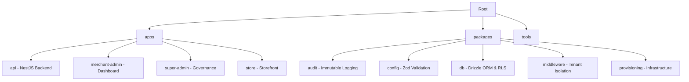

# Apex Monorepo Structure

This project is a high-performance monorepo managed by **Turborepo** and powered by **Bun**. It follows the **Island Architecture** pattern for package isolation and the **S1-S15 Security Protocols** for enterprise-grade compliance.

## Directory Structure



## Key Technologies

- **Package Manager**: [Bun](https://bun.sh/) (Fastest runtime & PM)
- **Build System**: [Turborepo](https://turbo.build/repo) (Remote caching & parallel execution)
- **Framework**: [NestJS](https://nestjs.com/) (Modular backend)
- **Database**: [PostgreSQL](https://www.postgresql.org/) with [Drizzle ORM](https://orm.drizzle.team/)
- **Security**: [Zod](https://zod.dev/) for environment and input validation

## Getting Started

1. **Install Dependencies**:
   ```bash
   bun install
   ```

2. **Environment Setup**:
   Copy `.env.example` to `.env` in the root and relevant apps.

3. **Development Mode**:
   ```bash
   bun run dev
   ```

4. **Build All**:
   ```bash
   bun run build
   ```

## Compliance (S1-S15)

All packages must adhere to the security protocols defined in `docs/architecture.md`. Cross-boundary deep imports are strictly forbidden. Always export the public API via `index.ts`.
